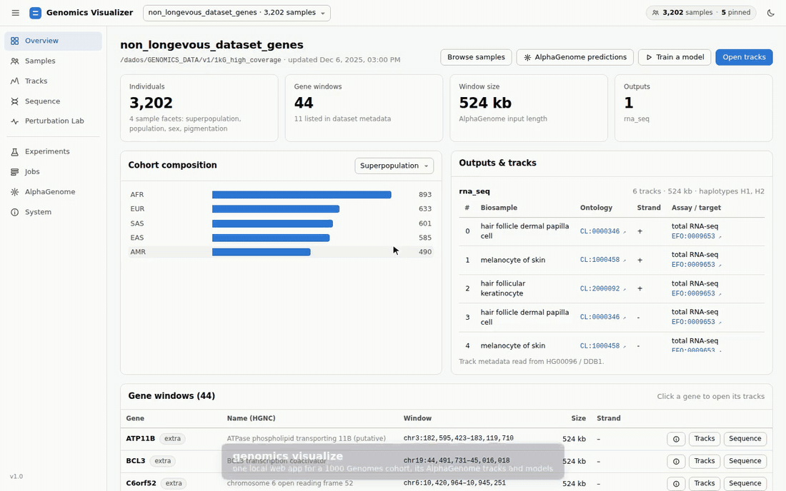

# Genomics

Multi-pipeline genomics workspace with one primary command-line interface: `genomics`.

The repository contains an operational genome processing workflow, dataset builders, AlphaGenome integration, ancestry/model predictors, shared ML infrastructure, a native C++ tool, a modified third-party ancestry calculator, and legacy reproducibility code.

## Run the Visualizer

The visualizer is the main way to use this repository: one local web app to explore a cohort, its
AlphaGenome prediction tracks, haplotype sequences and experiment runs, and to start imports,
predictions and training jobs.



<sub>1000 Genomes cohort (3,202 samples), TYRP1 window. Higher quality:
[visualizer-demo.mp4](docs/assets/visualizer-demo.mp4).</sub>

**1. Install** (once, from the repository root):

```bash
scripts/env/install.sh          # conda env "genomics" with bcftools/samtools and the [visualizer] extra
conda activate genomics
```

or with pip in any Python ≥ 3.10 environment:

```bash
python3 -m pip install -e ".[visualizer]"
```

Then check what this machine can run (packages, tools, AlphaGenome backend, GPU, free disk):

```bash
genomics doctor
```

**2. Start it and open the browser:**

```bash
genomics visualize --open
```

That's it. The app is served at **http://localhost:8780/**. It uses the default dataset
(`1kg_high_coverage`) when it is available here. If no dataset is found, it still starts and you
can add or import one from the UI.

**Use another dataset** (any directory with `dataset_metadata.json`, repeatable):

```bash
genomics visualize --dataset /path/to/dataset --open
```

**Good to know:**

- **Already running?** Run `genomics visualize --open` again. It finds the running visualizer and
  opens it instead of starting a second one.
- **Stop it** with `Ctrl+C` in the terminal where it runs. Background jobs keep running.
- **Port 8780 busy?** It takes the next free port and prints the URL. Use `--port N` to pick one.
- **On a remote server over SSH:** start it there with `genomics visualize`. It prints the tunnel
  command to run on your own computer, e.g. `ssh -N -L 8780:localhost:8780 user@host`. Then open
  http://localhost:8780/ locally.
- **AlphaGenome predictions** (Perturbation Lab, prediction jobs) need `ALPHAGENOME_API_KEY` in the
  environment or `~/.env`, or a server: on a machine with an NVIDIA GPU run
  `genomics alphagenome server setup` once, then choose *This machine* → *Start server* on the
  AlphaGenome page. A server elsewhere: `--alphagenome-address grpc://host:50051`.
- **Training and the Perturbation Lab's model scoring** need PyTorch: `scripts/env/install.sh --training`
  (or `pip install -e ".[visualizer,genotype]"`).
- **Requirements** per feature, dataset sizes and compute times:
  [docs/getting-started/requirements.md](docs/getting-started/requirements.md). The app's **System**
  page shows the same report as `genomics doctor`.
- **All options:** `genomics visualize --help`. Full guide (pages, controls, data sources):
  [docs/components/visualizer.md](docs/components/visualizer.md).

## Quick Start

Install the package in editable mode from the repository root (extras per pipeline are listed in
[Installation](docs/getting-started/installation.md)):

```bash
python3 -m pip install -e ".[visualizer]"
```

Use the CLI:

```bash
genomics --help
genomics genomes-analyzer run --config configs/genomes_analyzer/config_human_30x_low_memory.yaml
genomics genotype train configs/predictors/genotype_based/genes_1000_all_3ontologies.yaml
genomics variant train configs/predictors/variant_transformer/repo_layout.example.yaml
genomics snp-ancestry run --config configs/predictors/snp_ancestry/default.yaml
```

Activate the Conda environment and Bash completion:

```bash
source scripts/env/start_genomics_universal.sh
```

The activation script loads Bash completion automatically when `genomics` is installed.

## Documentation

Public documentation is built from `mkdocs.yml` and the Markdown sources in `docs/` with
Material for MkDocs. The published site is available with GitHub Pages at:

https://albertodesouza.github.io/genomics/

Serve the same MkDocs site locally with:

```bash
python3 -m pip install -e ".[docs]"
mkdocs serve
```

Start with:

- [Documentation Home](docs/index.md)
- [Installation](docs/getting-started/installation.md)
- [Requirements](docs/getting-started/requirements.md)
- [CLI Reference](docs/reference/cli.md)
- [Repository Layout](docs/reference/repository-layout.md)
- [Configuration Layout](configs/README.md)

## Main Components

| Component | Documentation |
|---|---|
| **Visualizer** (`genomics visualize`) | [docs/components/visualizer.md](docs/components/visualizer.md) |
| Genomes Analyzer workflow | [docs/components/genomes-analyzer.md](docs/components/genomes-analyzer.md) |
| Genotype-based predictor | [docs/components/genotype-predictor.md](docs/components/genotype-predictor.md) |
| Variant transformer predictor | [docs/components/variant-transformer.md](docs/components/variant-transformer.md) |
| SNP ancestry predictor | [docs/components/snp-ancestry.md](docs/components/snp-ancestry.md) |
| VCF to 23andMe converter | [docs/components/vcf-to-23andme.md](docs/components/vcf-to-23andme.md) |
| AlphaGenome workflow | [docs/components/alphagenome.md](docs/components/alphagenome.md) |
| Dataset builders | [docs/components/dataset-builders.md](docs/components/dataset-builders.md) |
| Native and third-party tools | [docs/components/native-and-third-party.md](docs/components/native-and-third-party.md) |
| Legacy code | [docs/components/legacy.md](docs/components/legacy.md) |

## Development Checks

Run the test suite:

```bash
python3 -m pytest tests
```

Run documentation build when MkDocs is installed:

```bash
mkdocs build --strict
```
