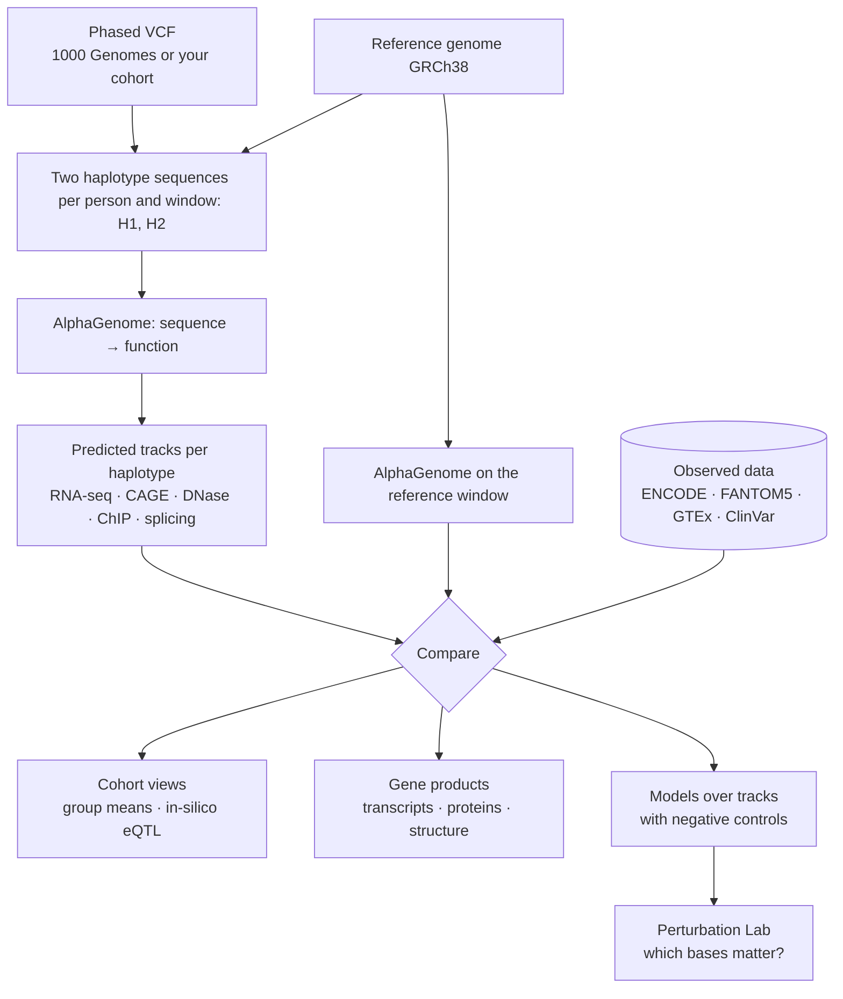

# From Genome To Function

The workspace started as a set of models that predicted ancestry and pigmentation from genotypes. It
became something else: a way to look at **what each individual's DNA does to their genes**, and at
how far each of those predictions can be trusted. This page explains that approach. The
[tutorial](../visualizer/index.md) shows it in practice.

## The chain

The input is a **phased VCF**: for every person, which allele sits on each of their two copies of
a chromosome. For every gene of interest, a window of the reference genome (524 kb by default,
AlphaGenome's input length) is rewritten with each copy's variants. The result is two sequences
per person and window, **H1** and **H2**. AlphaGenome predicts each one, so a person ends up with
two sets of tracks per window: predicted RNA-seq, CAGE, DNase, histone and TF ChIP-seq and
splicing, in the cell types and tissues chosen.

Everything else in the workspace either **compares** those tracks with something or **uses** them.

## Principles

### 1. Two copies, each on its own sequence

A person does not have "a genotype at a site". They have two copies of a gene, each with its own
combination of variants. The workspace keeps the copies apart all the way through. Both are
predicted separately and spliced and translated separately, and both are shown side by side.
Insertions and deletions shift every position after them, so each haplotype's prediction is mapped
back to **genomic coordinates** through its own indels before it is compared with anything (see
[coordinate systems](../visualizer/reference.md#coordinate-systems)). The CNN models can instead
read the shared **training axis**
([Dynamic Indel Tensor Alignment](../concepts/dynamic-indel-tensor-alignment.md)).

### 2. Every prediction has a baseline

A predicted track only means something next to the same model's prediction for the **reference
genome** (stored as `references/windows/<gene>/predictions_ref/`). The difference between a haplotype
and the reference is what the model is trusted with, because the ratio cancels most of its
calibration error. Absolute numbers appear only when an **observed anchor** exists: GTEx tissue
TPM, or Human Protein Atlas single-cell nCPM. They are always labelled as estimates. The
[Gene products page](../visualizer/gene-products.md), for example, says *0.80× the reference*
(relative) and *≈ 1,000 nCPM* (absolute, anchored on HPA melanocytes) as two separate statements.

### 3. Every prediction meets data

AlphaGenome was trained on experiments, so each of its tracks can be put next to the experiment it
came from:

| Prediction | Checked against | Where |
|---|---|---|
| A track's shape over a locus | The ENCODE / FANTOM5 experiments with the same ontology term, assay and target, with Pearson r, peak overlap and the ratio of means | [Tracks](../visualizer/tracks.md#compare-with-the-reference-and-with-observed-data) |
| A variant's effect on expression across the cohort | GTEx v8 eQTL of the same variant, tissue by tissue (direction of effect) | [Variant](../visualizer/variant.md) |
| Transcripts and proteins built per haplotype | Ensembl peptides and `bcftools csq` consequences | [Gene products](../visualizer/gene-products.md) |
| A missense change | AlphaMissense, ClinVar, GWAS Catalog, AlphaFold DB structures | [Gene products](../visualizer/gene-products.md#3-protein-shape) |

The checks do not always agree, and the disagreements are shown rather than hidden. For TYRP1,
melanocyte RNA-seq follows ENCODE closely (r 0.84 over the gene). Melanocyte CAGE, however, is
predicted about 4.5× higher than FANTOM5 measures. For rs12913832, the blue-eye variant, GTEx skin
shows lower OCA2 expression with the G allele. AlphaGenome's melanocyte RNA-seq over OCA2 shows no
association at all (p = 0.86 over 3,202 genomes).

The gene-product builder was checked against independent tools on HG00096. All 166 complete
reference proteins are identical to Ensembl 112. All 454 transcript × haplotype consequences agree
with `bcftools csq` (`scripts/diagnostics/validate_gene_products.py`).

### 4. Controls before claims

A model that separates two groups of people can be learning anything that differs between the
groups. In a cohort like 1000 Genomes, that is mostly **ancestry**. The pigmentation labels of the
1000 Genomes dataset are the cautionary example. On the [Ancestry PCA](../visualizer/samples.md#ancestry-pca-and-matching),
the *weak* (European) and *strong* (African) groups are 10.4 pooled standard deviations apart on
PC1, and no ancestry-matched pair exists. The label is population membership, so a classifier
that "predicts pigmentation" might only be predicting where people's ancestors lived.

So the workspace builds the controls in, and the
[training form](../visualizer/experiments.md#negative-controls) offers them next to the real run:

- **Shuffled labels**: the pipeline's chance-level floor.
- **Labels shuffled within superpopulation**: what ancestry alone explains. A real result has to
  beat this one.
- **Matched control windows**: the same model over genes that have nothing to do with the
  phenotype, but carry as much predicted signal.
- **Ancestry matching**: compare groups only through pairs of people with the same genetic
  background.

### 5. Ask the model why

When a trained model makes a call, the [Perturbation Lab](../visualizer/perturbation-lab.md) edits
the haplotype in silico (scramble, overwrite, revert to the reference), re-predicts it with
AlphaGenome and re-scores it with the model. A **saturation scan** slides the edit across a region,
which turns "the model says strong pigmentation" into "these kilobases move the probability".

### 6. Local, inspectable, reproducible

- Every dataset has the same [canonical layout](../reference/data-registry.md). Files are plain
  FASTA, VCF and `.npz`, one directory per sample and window, so any page works on any cohort,
  including one you import.
- Long work runs as **background jobs** whose exact commands are stored with them (`task.json`).
  Any job can be re-run from a shell.
- Figures are exported with their locus, tracks, cohort and date in the caption. The
  [notebook client](../visualizer/notebook.md) returns the same arrays the app draws, so the
  notebook and the app cannot quietly disagree.
- Public databases (HGNC, Gene Ontology, OLS, ENCODE, FANTOM5, GTEx, Ensembl) are cached after
  first use. `--no-remote` keeps everything offline.

## Vocabulary

| Term | Meaning |
|---|---|
| **Haplotype** (H1, H2) | One of a person's two phased copies of a window |
| **Window** | The stretch of genome around a gene (or regulatory element) that AlphaGenome predicts, usually 524 kb |
| **Output** | An AlphaGenome assay family: `rna_seq`, `cage`, `dnase`, `atac`, `chip_histone`, `chip_tf`, `procap`, splicing outputs, contact maps |
| **Track** | One output in one biosample and strand, e.g. *RNA-seq · melanocyte of skin (CL:1000458) · strand +* |
| **Ontology term** | The biosample's ID: CL (cell types), UBERON (tissues), EFO (cell lines) |
| **Reference prediction** | AlphaGenome on the reference genome's window: the baseline |
| **Observed data** | The ENCODE / FANTOM5 experiment behind a track, in its own units |
| **Cohort** | The samples that pass the filters on the Samples page. It drives group means, heatmaps and training |
| **Pinned** | The individuals shown one by one on Tracks, Sequence and the Perturbation Lab |
| **Model window** | The central part of a window (32 kb by default) that the CNN models read, drawn as a blue band |
