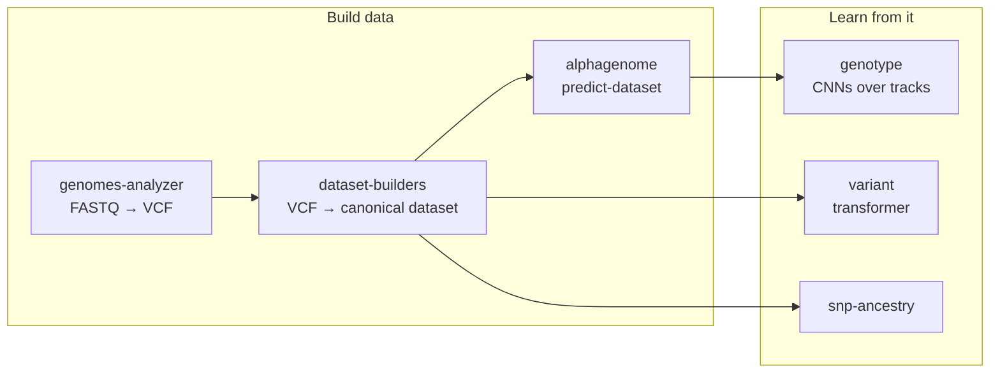

# Pipelines

The [visualizer](../visualizer/index.md) is the front door. Behind it are command-line pipelines
that do the heavy lifting and can be scripted, scheduled or run on a cluster. Most visualizer forms
start one of them as a background job, and each job stores the exact command it ran
(`results/visualizer/jobs/<id>/task.json`).

| Pipeline | CLI | Visualizer equivalent | Code |
|---|---|---|---|
| [Dataset builders](dataset-builders.md) | `genomics dataset-builders` | [Import dataset](../visualizer/import.md) | `src/genomics/workflows/dataset_builders/` |
| [AlphaGenome](alphagenome.md) | `genomics alphagenome` | [AlphaGenome predictions, AlphaGenome page](../visualizer/running-work.md) | `src/genomics/workflows/alphagenome/` |
| [Genotype predictor](genotype-predictor.md) | `genomics genotype` | [Experiments](../visualizer/experiments.md), [Perturbation Lab](../visualizer/perturbation-lab.md) | `src/genomics/predictors/genotype_based/` |
| [Variant transformer](variant-transformer.md) | `genomics variant` | – | `src/genomics/predictors/variant_transformer/` |
| [SNP ancestry](snp-ancestry.md) | `genomics snp-ancestry` | – | `src/genomics/predictors/snp_ancestry/` |
| [Genomes analyzer](genomes-analyzer.md) | `genomics genomes-analyzer` | – | `src/genomics/workflows/genomes_analyzer/` |
| [VCF to 23andMe](vcf-to-23andme.md) | `genomics convert vcf-to-23andme` | – | `src/genomics/converters/vcf_to_23andme/` |
| [Native and third-party](native-and-third-party.md) | – | – | `native/`, `third_party/` |
| [Legacy](legacy.md) | – | – | `legacy/` |

To reproduce the 1000 Genomes results from the command line, follow
[Building 1000 Genomes dataset](../guides/building-1000-genomes-dataset.md), then
[Training and running predictions](../guides/training-and-running-predictions.md). Every
subcommand is listed in the [CLI reference](../reference/cli.md).

All active Python code imports through `genomics.*` or relative imports inside the same package.
