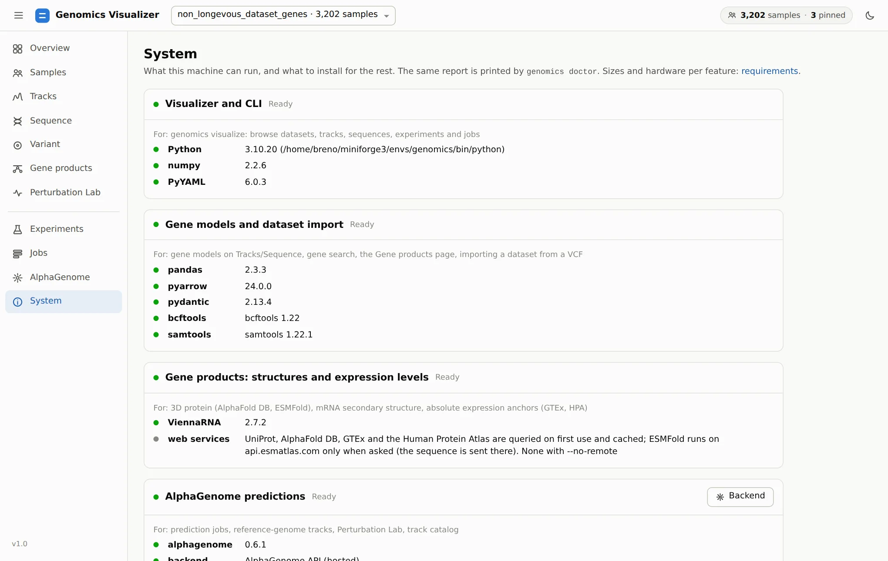
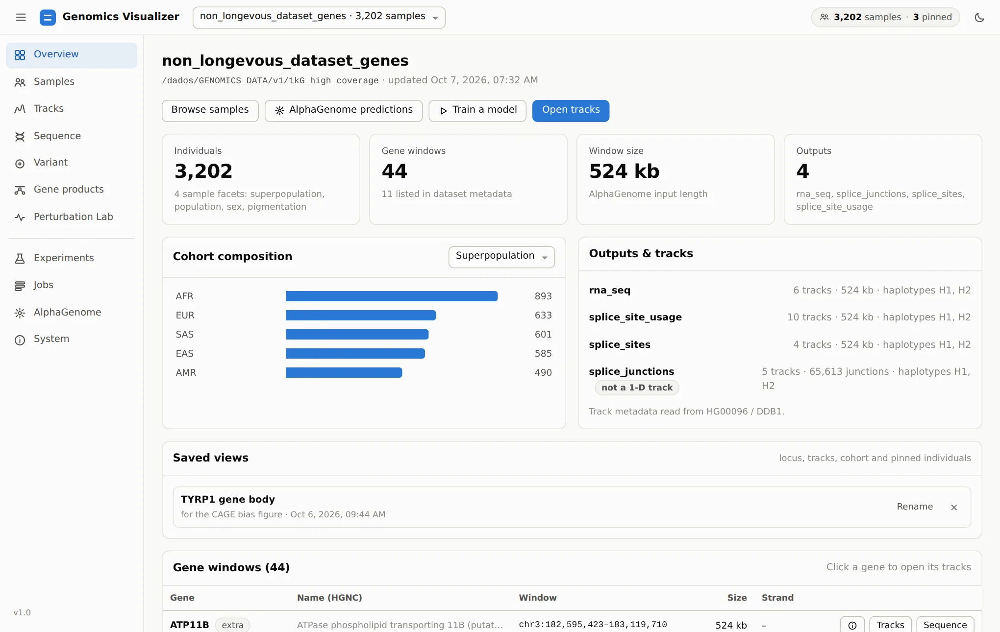
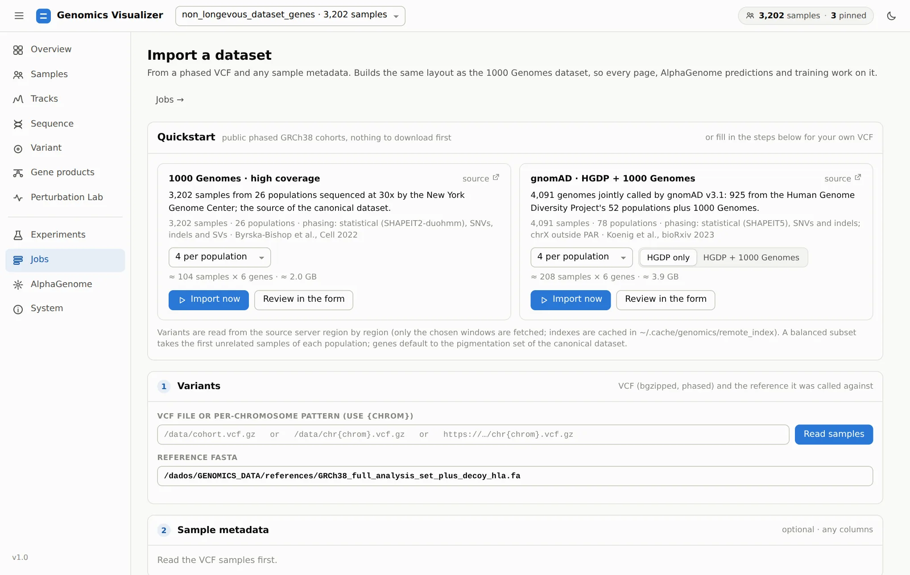

# Your First Session

From a fresh checkout to predicted tracks for a public cohort in about ten minutes. The detailed
options are in [Installation](installation.md) and [Requirements](requirements.md).

## 1. Install

From the repository root, on Linux or macOS:

```bash
scripts/env/install.sh       # conda env "genomics" (Python 3.11, bcftools, samtools, the [visualizer] extra)
conda activate genomics
```

Add `--training` if you also want to train models and use the Perturbation Lab's scoring
(PyTorch).

## 2. Check what this machine can run

```bash
genomics doctor
```

`doctor` checks each feature (browsing, gene models, dataset import, AlphaGenome predictions,
training). For anything missing it prints the command that enables it. The app's
**System** page shows the same report:

<figure markdown="span">
  
  <figcaption>System page: every feature this machine can run, with its packages and tools.</figcaption>
</figure>

## 3. Give it AlphaGenome

Browsing works without AlphaGenome. Predicting new tracks needs one backend:

=== "Hosted API (quickest)"

    Get a free key for non-commercial use at <https://deepmind.google.com/science/alphagenome>,
    then:

    ```bash
    echo "ALPHAGENOME_API_KEY=your-key" >> ~/.env
    ```

=== "Your own NVIDIA GPU"

    ```bash
    genomics alphagenome server setup        # clone alphagenome_research, create its env, check the weights
    ```

    Then choose *This machine → Start server* on the app's AlphaGenome page.
    Accept the model terms on Hugging Face first; see
    [Requirements](requirements.md#alphagenome-on-your-own-gpu).

=== "A server elsewhere"

    ```bash
    genomics visualize --alphagenome-address grpc://10.0.0.5:50051
    ```

## 4. Open the app

```bash
genomics visualize --open
```

The app is served at <http://localhost:8780/>. Over SSH, it prints the tunnel command to run on
your own computer. If the registered 1000 Genomes dataset (`1kg_high_coverage`) exists on this
machine, it opens on it. Otherwise it starts empty, and you import a cohort in the next step.

<figure markdown="span">
  
  <figcaption>The Overview page of the 1000 Genomes dataset: 3,202 individuals and 44 gene
  windows.</figcaption>
</figure>

## 5. Import a public cohort (if you have no dataset)

Open **Jobs → Import dataset**. The **Quickstart** card imports a public phased GRCh38 cohort
without downloading anything first: bcftools streams only the windows you need from the source
server.

<figure markdown="span">
  
  <figcaption>Quickstart: choose how many samples per population, then <em>Import now</em>.</figcaption>
</figure>

*1 per population* with the default six pigmentation genes takes about a minute and ~0.7 GB.
When the job finishes, the dataset opens by itself. To add AlphaGenome tracks, use **Overview →
AlphaGenome predictions**. See [Bring your own cohort](../visualizer/import.md).

## 6. Take the tour

Continue with the [Visualizer tutorial](../visualizer/index.md). It goes through every page on
one running example.

## Stopping and coming back

- `Ctrl+C` stops the app. Background jobs (imports, predictions, training) keep running.
- `genomics visualize --open` reopens the instance that is already running instead of starting a
  second one.
- Pinned individuals, filters and the locus are remembered per dataset in the browser. A **saved
  view** keeps a whole Tracks setup on disk (see [Read predicted tracks](../visualizer/tracks.md#save-the-view-export-the-figure)).
