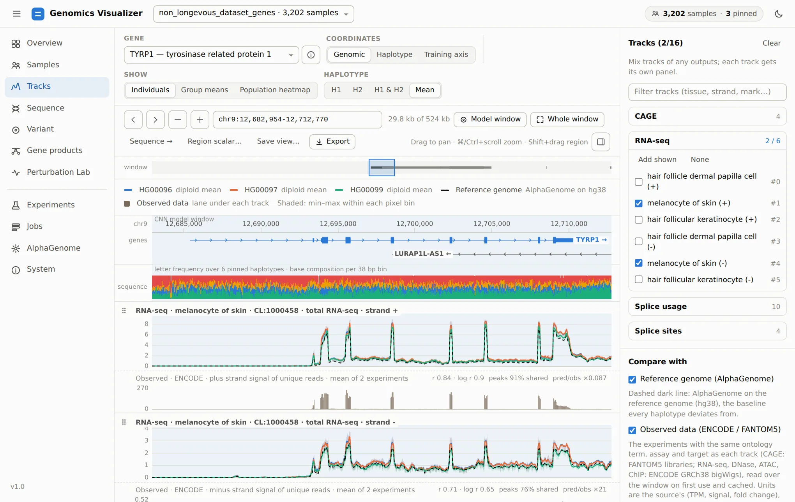

# Genomics Workspace

**What does a person's genome change about how their genes work?** This workspace answers that
question one individual, one haplotype and one gene at a time. Each person's two phased copies of
a region go through [AlphaGenome](https://deepmind.google.com/science/alphagenome), which predicts
expression, splicing, accessibility and binding. Every prediction is then put next to evidence it
can be checked against.

Everything is reachable from one local web app, **`genomics visualize`**:

<figure markdown="span">
  
  <figcaption>The Tracks page on the 1000 Genomes dataset. It shows three individuals' predicted
  melanocyte RNA-seq over TYRP1 and AlphaGenome's prediction for the reference genome (dashed). Under
  each track is the ENCODE experiment the track was trained on, with how well the two agree.</figcaption>
</figure>

## Where to start

<div class="grid cards" markdown>

-   **Try it in ten minutes**

    ---

    Install, check the machine with `genomics doctor`, open the app and import a public cohort.

    [:octicons-arrow-right-24: Your first session](getting-started/first-session.md)

-   **Learn the app, page by page**

    ---

    A guided tour along one question: what does HG00096's genome do to their pigmentation genes,
    and can the model be trusted on it?

    [:octicons-arrow-right-24: Visualizer tutorial](visualizer/index.md)

-   **Understand the approach**

    ---

    Why the workspace predicts each haplotype on its own sequence, and how it uses baselines,
    observed data and negative controls before trusting a result.

    [:octicons-arrow-right-24: From genome to function](approach/index.md)

-   **Script it**

    ---

    Dataset builders, AlphaGenome prediction, model training and the other pipelines, from the
    command line or a notebook.

    [:octicons-arrow-right-24: Pipelines](components/index.md) ·
    [CLI reference](reference/cli.md)

</div>

## Quick start

```bash
scripts/env/install.sh       # conda env "genomics" with everything the visualizer can use
conda activate genomics
genomics doctor              # what this machine can run, and how to enable the rest
genomics visualize --open
```

## What is in the box

| Area | What it does | Where |
|---|---|---|
| **Visualizer** | Cohorts, AlphaGenome tracks against the reference and observed data, haplotype sequences, variant effects, transcripts and proteins per haplotype, model training and in-silico perturbation, all in one app | [Tutorial](visualizer/index.md) · [Reference](visualizer/reference.md) |
| AlphaGenome | Predictions through the hosted API or a model server on your own NVIDIA GPU | [AlphaGenome](components/alphagenome.md) |
| Dataset builders | Canonical per-sample, per-window datasets from 1000 Genomes or any phased VCF | [Dataset builders](components/dataset-builders.md) |
| Predictors | CNNs over predicted tracks, a variant transformer, and SNP ancestry | [Genotype predictor](components/genotype-predictor.md) |
| Genome processing | FASTQ/BAM/CRAM → VCF (`genomes-analyzer`), VCF → 23andMe | [Genomes analyzer](components/genomes-analyzer.md) |

All of it runs through one command, `genomics` (`genomics --help`), and one package,
`src/genomics/`.
