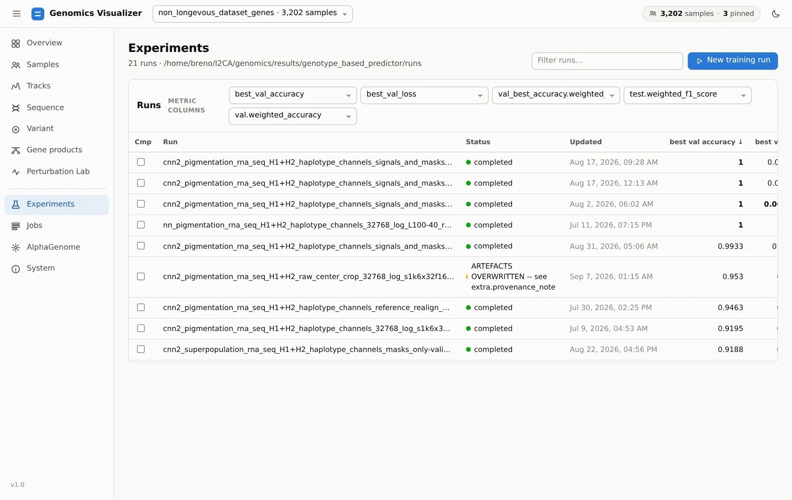
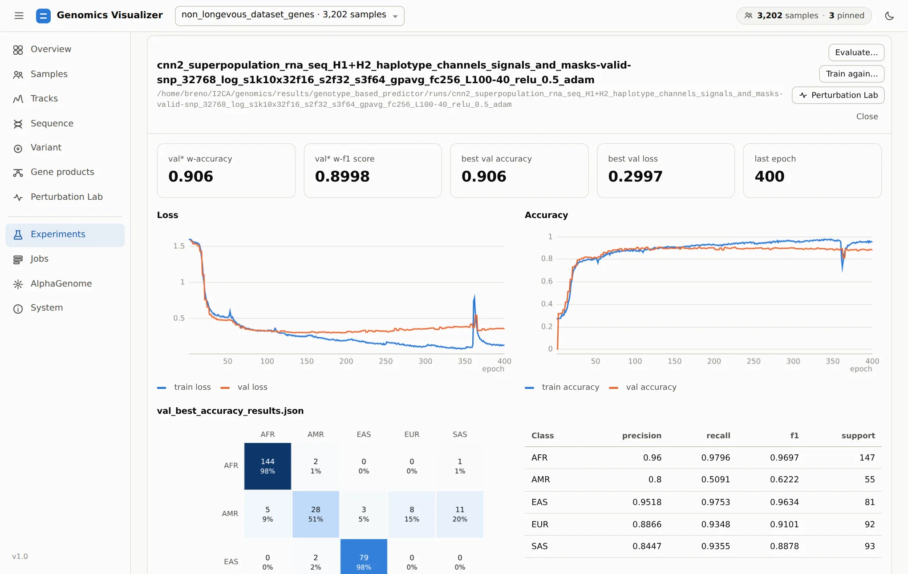
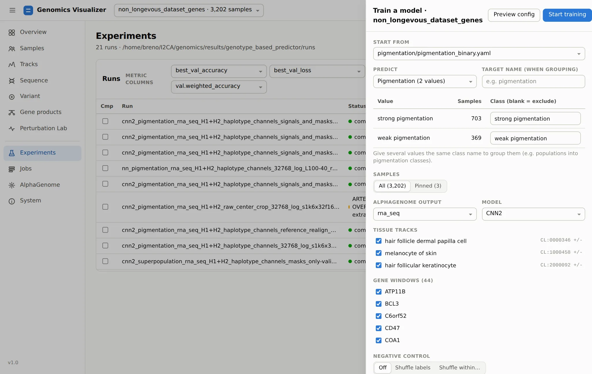
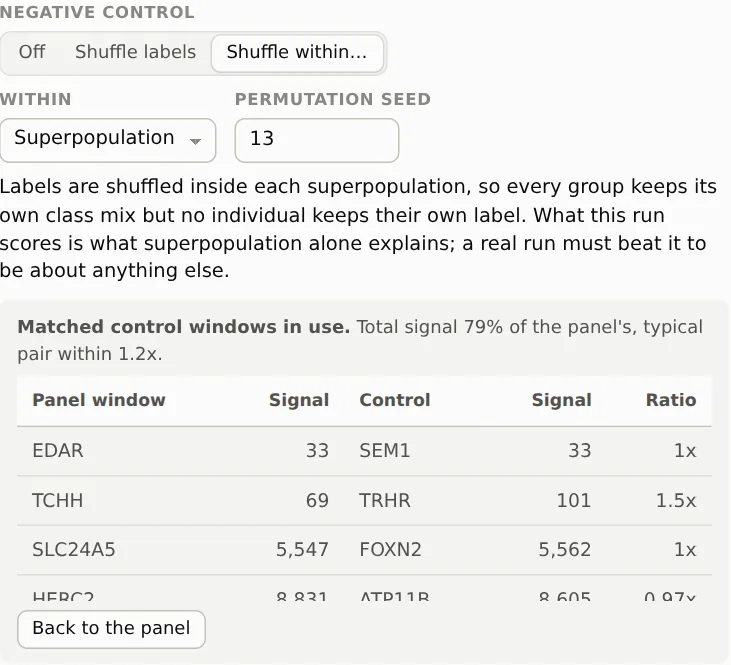

# 7. Train And Evaluate Models

**Page:** Experiments · **Goal:** train a model that reads predicted tracks, read its results, and
find out what it actually learned.

Needs the `[genotype]` extra (PyTorch): `scripts/env/install.sh --training`.

## The runs table

<figure markdown="span">
  
  <figcaption>Every run under the runs root. The metric columns can be any numeric field of the
  runs' results, <code>weighted_*</code> included, and every column sorts.</figcaption>
</figure>

Look at the top of the table. Several pigmentation CNNs reach a **validation accuracy of 1**. That is
too good for a trait as complex as pigmentation, and [step 2](samples.md#ancestry-pca-and-matching)
explains why. In this cohort, *weak* and *strong* pigmentation are European and African genomes, and
those can be told apart from almost any stretch of DNA. Before reading such a number as biology,
compare it with a run that cannot have learned biology. That is what the negative controls below
are for.

Tick **Cmp** on several runs to overlay their training curves.

## A run

Click a run to open it:

<figure markdown="span">
  
  <figcaption>A CNN predicting superpopulation from melanocyte RNA-seq: 0.906 weighted validation
  accuracy. AMR, the admixed group, is the one it confuses.</figcaption>
</figure>

The run page shows the summary metrics, train and validation **loss and accuracy curves**, the
**confusion matrix** and per-class precision, recall and F1 for each results file, the config and
the plots the run saved. Three buttons act on it:

- **Evaluate…** evaluates any checkpoint on any split, as a background job
  (`<split>_<checkpoint>_results.json`).
- **Train again…** opens the training form prefilled with this run's settings.
- **Perturbation Lab** opens the run in [step 8](perturbation-lab.md).

## Start a training run

**New training run** (or **Train a model** on the Overview or Jobs page) opens the training form:

<figure markdown="span">
  
  <figcaption>The training form, starting from <code>pigmentation_binary.yaml</code>.</figcaption>
</figure>

1. **Start from** a config under `configs/predictors/genotype_based/` or from an existing run.
2. **Predict** any categorical sample field. Each value maps to a class, and values can be grouped
   (e.g. populations into pigmentation classes) or excluded.
3. **Samples**: all, or only the pinned ones (for a quick smoke run).
4. **AlphaGenome output**, **model** (NN, CNN, CNN2), **tissue tracks** and **gene windows**.
5. The window around each gene, the features, epochs, batch size, learning rate, seed and split
   fractions.

**Preview config** shows the YAML the run will use. **Start training** queues it on the `gpu` queue.
The run appears on this page with live curves, and the best checkpoint is evaluated on the test
split when training ends.

## Negative controls

A classifier's accuracy only means something next to what the same pipeline scores when the signal
it is supposed to use is gone. The form builds two kinds of control into the same run:

<figure markdown="span">
  { width="560" }
  <figcaption>Labels shuffled within superpopulation, and the 11 pigmentation windows swapped for
  11 control windows that carry comparable predicted signal.</figcaption>
</figure>

**Shuffled labels.** **Shuffle labels** permutes labels over all samples. Class sizes stay the same,
but nothing links a genome to its class, so this run is the pipeline's chance floor. Anything above
it means a leak (through the split, the normalization or a cache). **Shuffle within…** permutes
inside each group of a field. With *superpopulation*, every population keeps its own class mix, but
no individual keeps their own label. What that run scores is **what ancestry alone explains**, and a
real pigmentation result has to beat it. Runs are tagged `_yrand` / `_yrand_within_<field>`.

**Matched control windows.** **Matched control windows…** replaces the gene panel with an equal
number of windows outside the dataset's gene list. It does not pick them at random: each control is
matched to a panel window on the **total predicted signal inside the crop the model reads**, on the
reference genome. A quiet control window would be flat for reasons unrelated to biology and would
prove nothing. The match needs no AlphaGenome calls, only the stored reference predictions, and the
form shows every pair before you start. Here the 11 pigmentation windows pair with SEM1, TRHR,
FOXN2, ATP11B, … for a control panel carrying 79% of the panel's total signal (typical pair within
1.2×).

!!! tip "A reading order for any result"
    1. Real labels, real panel: the number you hope is interesting.
    2. Shuffled labels: the floor. If (1) is not far above it, stop.
    3. Shuffled within superpopulation: what ancestry explains. (1) must beat it.
    4. Matched control windows, real labels: what any comparably expressed genes give. (1) must
       beat that too before it is about *these* genes.

Configs, schemas and the CLI equivalents (`genomics genotype train | evaluate | test`) are in
[Genotype predictor](../components/genotype-predictor.md) and
[Training and running predictions](../guides/training-and-running-predictions.md).

[Next: ask the model why :octicons-arrow-right-24:](perturbation-lab.md){ .md-button }
