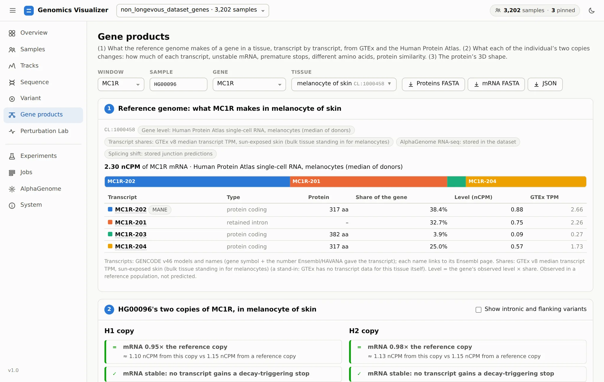
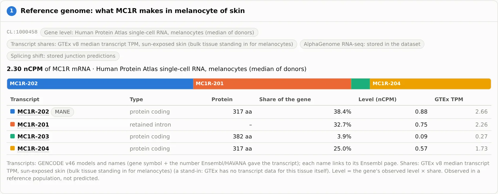
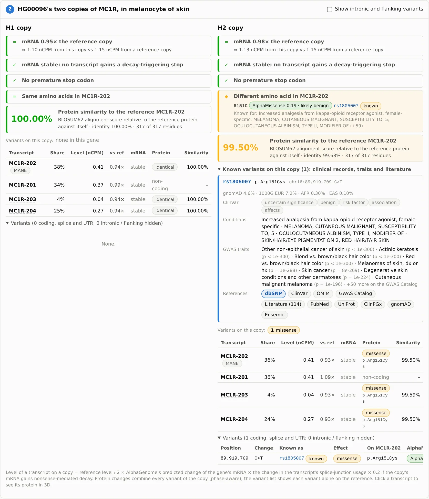
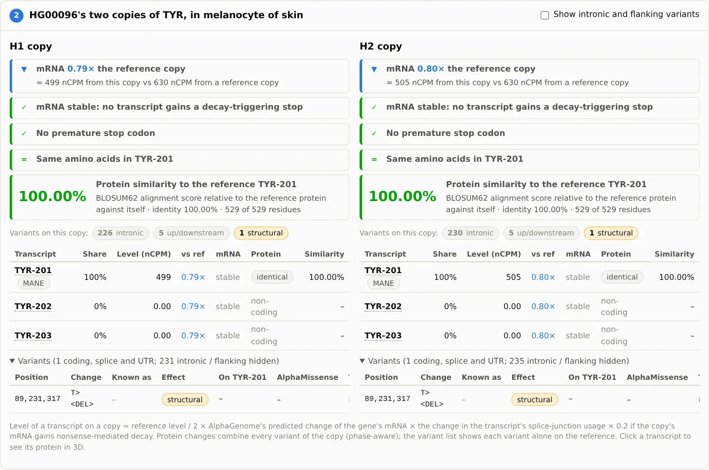
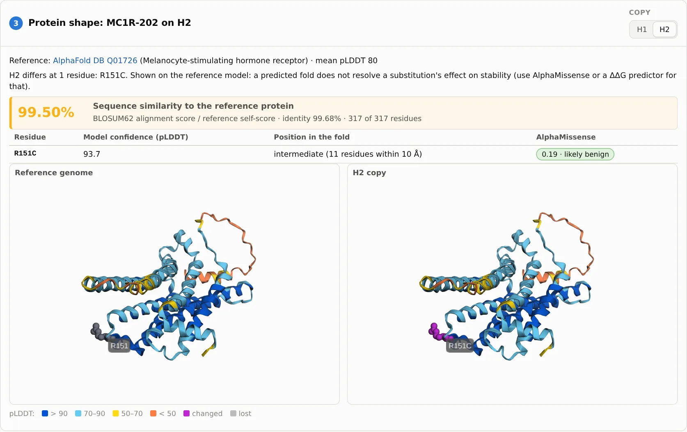
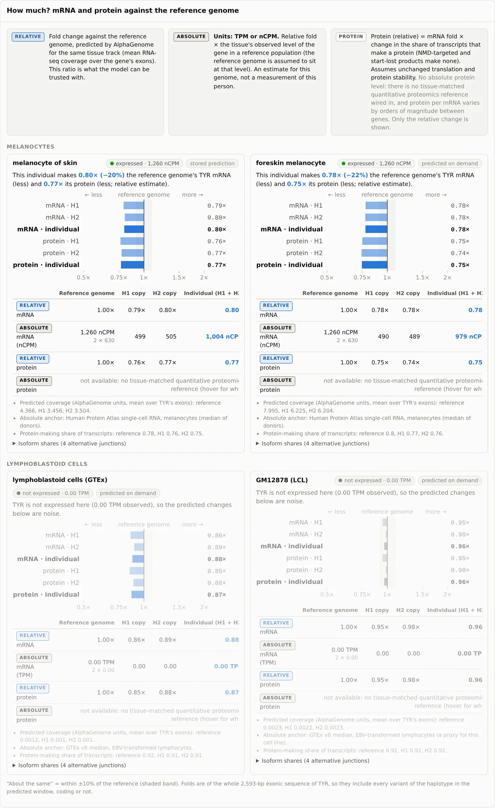
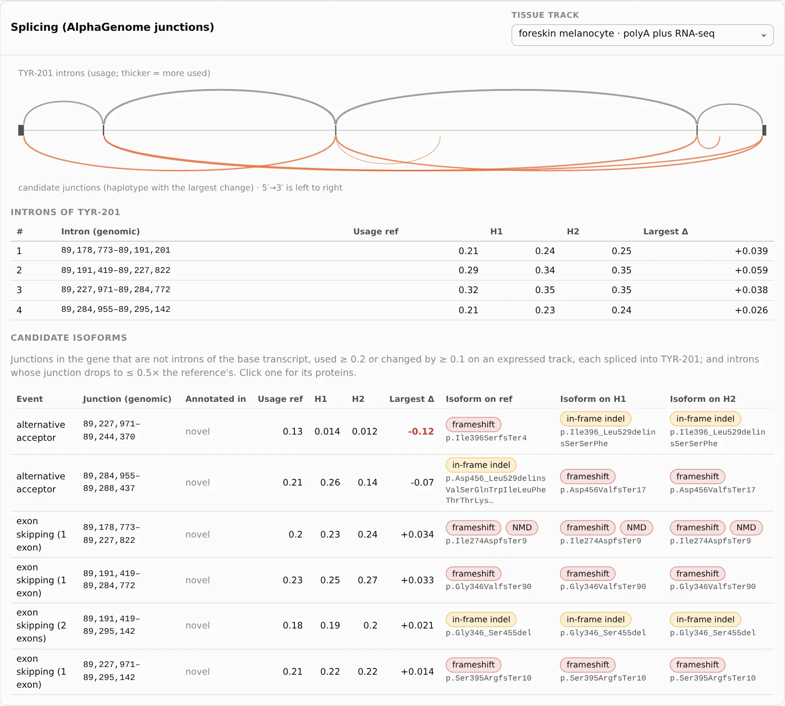

# 6. From DNA To Protein

**Page:** Gene products · **Goal:** follow one individual's two copies of a gene into the mRNA and
protein each copy makes in a tissue, and say how sure each statement is.

Choose a **window**, a **sample**, a **gene** and a **tissue**. The tissue picker lists all 285
ontology terms AlphaGenome has RNA-seq for. We look at HG00096 in *melanocyte of skin*
(CL:1000458), first at **MC1R**, the red-hair gene, then at **TYR**.

<figure markdown="span">
  
  <figcaption>The page reads top to bottom as a pipeline: (1) what the reference genome makes,
  (2) what each of the individual's copies changes, (3) the protein's shape.</figcaption>
</figure>

The chips under each heading say where every number comes from: observed (Human Protein Atlas,
GTEx), predicted (AlphaGenome RNA-seq and splice junctions, stored or predicted on demand), or
computed (translation, NMD rules).

## 1. Reference genome: what the gene makes

<figure markdown="span">
  
  <figcaption>MC1R in melanocytes: 2.30 nCPM (Human Protein Atlas single-cell), split over its
  transcripts by GTEx transcript shares.</figcaption>
</figure>

This step is **observed, not predicted**. The gene's level comes from a reference population, and
GTEx's transcript TPMs split it over the transcripts. GTEx has no melanocytes, so sun-exposed skin
stands in, and the page says so. MC1R-202, the MANE Select transcript, makes 38% of the mRNA. A
retained-intron transcript makes another third.

## 2. The individual's two copies

<figure markdown="span">
  
  <figcaption>H1 makes the reference protein. H2 carries R151C (rs1805007), a well-known red-hair
  variant. The known-variant panel lists its ClinVar conditions, GWAS traits and references.</figcaption>
</figure>

Each copy gets the same checklist of verdicts:

| Verdict | How it is decided |
|---|---|
| **mRNA level vs a reference copy** | AlphaGenome RNA-seq of this haplotype vs the reference window, over the gene's exons (a fold), times the observed level for an absolute estimate |
| **mRNA stable** | No transcript gains a stop codon that triggers nonsense-mediated decay (50-nt rule, with the usual escapes) |
| **No premature stop** | No transcript's protein ends early (nonsense, frameshift) |
| **Same / different amino acids** | The copy's spliced, translated protein vs the reference. All of the copy's variants act together (phase-aware). Each missense change carries its **AlphaMissense** score |
| **Protein similarity** | BLOSUM62 global alignment score relative to the reference protein against itself (1 = identical) |

Variants the page lists are looked up in Ensembl VEP, which sends only positions and alleles.
**Known** variants get a panel with ClinVar significance and conditions, GWAS Catalog traits, gnomAD
and 1000 Genomes frequencies, and links to dbSNP, ClinVar, OMIM, LitVar, PubMed, UniProt, ClinPGx
and gnomAD. For rs1805007, ClinVar lists red hair / fair skin, melanoma susceptibility and a
female-specific increased analgesia from κ-opioid agonists. AlphaMissense still rates R151C as
*likely benign* (0.19). The page shows the population genetics and the structure-based score side
by side and does not reconcile them.

Now switch the gene to **TYR**:

<figure markdown="span">
  
  <figcaption>TYR in HG00096: both copies are predicted at about 0.8× the reference copy's mRNA,
  with an unchanged protein. Both carry a structural deletion in a TYR intron.</figcaption>
</figure>

Here the protein is identical on both copies, but AlphaGenome predicts **less mRNA**: 0.79× and 0.80×.
That is about 500 instead of 630 nCPM per copy, anchored on HPA melanocytes. Both copies carry an
intronic structural deletion (`<DEL>` at chr11:89,231,317). You will see it as a gap in the tracks
in [step 8](perturbation-lab.md).

## 3. Protein shape

<figure markdown="span">
  
  <figcaption>MC1R's AlphaFold DB model (Q01726), coloured by pLDDT, with residue 151 marked on the
  reference and on H2. Rotation is linked between the two views.</figcaption>
</figure>

For the selected transcript and copy, the page loads the reference protein's **AlphaFold DB** model
(found through UniProt's Ensembl cross-reference) and marks each substitution. It reports the
residue's model confidence (pLDDT 93.7 here) and how buried it is (11 neighbours within 10 Å). A
predicted fold does not show what a point mutation does to stability, and the page says so.
Products that change after some residue (frameshifts, in-frame indels, other isoforms) can be folded
with **ESMFold**, on request only, because the sequence is sent to `api.esmatlas.com`. The result
includes a TM-score against the reference. **More evidence** also has the mRNA's secondary structure
around the start codon, stop codon or a variant (ViennaRNA), with ΔΔG.

## More evidence

Everything else sits under **More evidence**.

**How much?** compares mRNA and protein against the reference genome in several tissues, and keeps
**relative** (what the model is trusted with) apart from **absolute** (relative × an observed
anchor):

<figure markdown="span">
  { width="720" }
  <figcaption>TYR in HG00096: 0.80× mRNA and 0.77× protein in melanocytes, similar in foreskin
  melanocytes. In lymphoblastoid cells TYR is not expressed, so the folds there are greyed out as
  noise.</figcaption>
</figure>

There is no absolute protein level: no tissue-matched quantitative proteomics reference is wired
in, and protein per mRNA varies by orders of magnitude between genes.

**Splicing** uses AlphaGenome's predicted splice junctions per haplotype:

<figure markdown="span">
  
  <figcaption>The base transcript's introns (arcs above) and candidate junctions (below), intron
  usage on the reference, H1 and H2, and the candidate isoforms with the protein each would
  make.</figcaption>
</figure>

Candidate isoforms are **hypotheses from a sequence model**, not measured transcripts. Usage values
are relative, not abundances. They are worth checking against RNA-seq of the individual, e.g.
Geuvadis for 1000 Genomes LCLs.

## Export

**Proteins FASTA**, **mRNA FASTA** and **JSON** download every product (annotated transcripts and
candidates, per haplotype) for pathway, structure or variant-effect tools.

!!! success "Checked against independent tools"
    On HG00096 (44 windows, GENCODE v46), all 166 complete reference proteins are identical to
    Ensembl 112's peptides. All 454 transcript × haplotype consequences agree with `bcftools csq -p a`
    run on the same VCFs (`scripts/diagnostics/validate_gene_products.py`).

[Next: train and evaluate models :octicons-arrow-right-24:](experiments.md){ .md-button }
