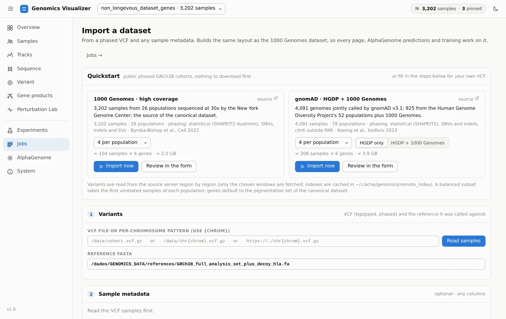

# 10. Bring Your Own Cohort

**Page:** Import dataset (from Jobs or Overview) · **Goal:** turn any phased VCF into a dataset that
every page of the app works on.

Nothing in the app is specific to 1000 Genomes. An import writes the same
[canonical layout](../reference/data-registry.md) as the 1000 Genomes builder: reference windows,
per-sample haplotype FASTA and window VCFs, and metadata. It is byte-identical for the same sample
and window.

## Quickstart with a public cohort

<figure markdown="span">
  
  <figcaption>Two public phased GRCh38 cohorts, nothing to download first.</figcaption>
</figure>

| Cohort | Samples | Source |
|---|---|---|
| 1000 Genomes high coverage (Byrska-Bishop et al. 2022) | 3,202 · 26 populations | EBI FTP |
| gnomAD HGDP + 1000 Genomes, SHAPEIT5 (Koenig et al. 2023) | 4,091 · 78 populations | gnomAD's public bucket |

Choose how many unrelated samples to take per population, then **Import now** (the six
pigmentation genes) or **Review in the form** (to change samples, genes or add AlphaGenome
predictions). Variants are not downloaded in bulk: bcftools reads only each window's region from the
remote file. One sample per population × 6 windows takes about a minute and ~0.7 GB.

## Your own VCF, step by step

<figure markdown="span">
  
  <figcaption>The import form: (1) variants, (2) sample metadata, then windows, output and
  predictions.</figcaption>
</figure>

1. **Variants.** A bgzipped, phased VCF (or a per-chromosome pattern with `{chrom}`, local or URL)
   and the reference FASTA it was called against. **Read samples** lists its samples and contigs
   and warns about unphased genotypes. `chr15` vs `15` naming is handled.
2. **Sample metadata** (optional, any columns). Upload a CSV, TSV, JSON or PLINK `.fam`, point to a
   file on the server, or paste a table. The sample-ID column is detected automatically. You can map
   a family column (keeps relatives in one split) and a sex column. The editable grid lets you add
   columns, paste from a spreadsheet, or derive a column from the sample IDs with a regular
   expression. **Every column becomes a sample field**: a facet, a grouping, a training target.
3. **Windows.** Gene symbols or Ensembl IDs, and/or `NAME=chr:start-end` regions. One AlphaGenome
   window (16 kb to 1 Mb, default 524 kb) is centred on each.
4. **Dataset** name and output directory (default `$GENOMICS_DATA_ROOT/imported/<name>`), and
   optionally **AlphaGenome predictions** right after the import.

The import runs as a [job](running-work.md#follow-jobs). It is resumable, so re-running it adds
samples or genes. When it finishes, the dataset opens and is remembered across restarts. The CLI
equivalent is `genomics dataset-builders vcf-import --spec spec.json`.

!!! tip "Phenotypes from elsewhere"
    To add sample columns to an existing dataset without re-importing it, start the app with
    `--annotations table.tsv` (first column = sample ID). The columns appear as facets on every page.

[Next: from a notebook :octicons-arrow-right-24:](notebook.md){ .md-button }
