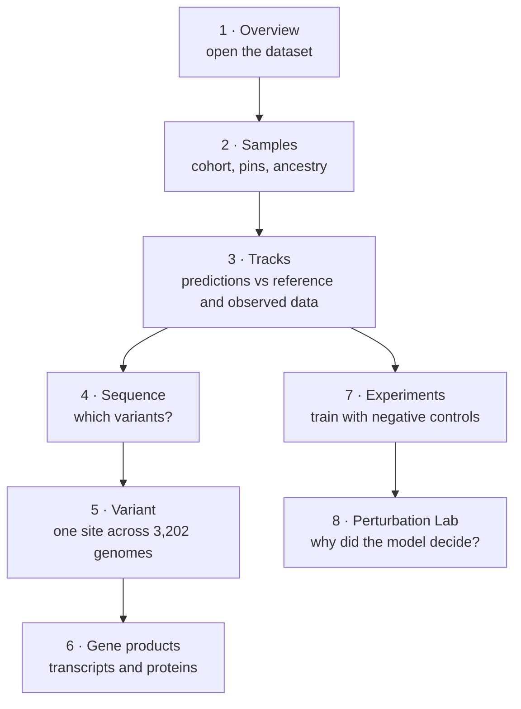
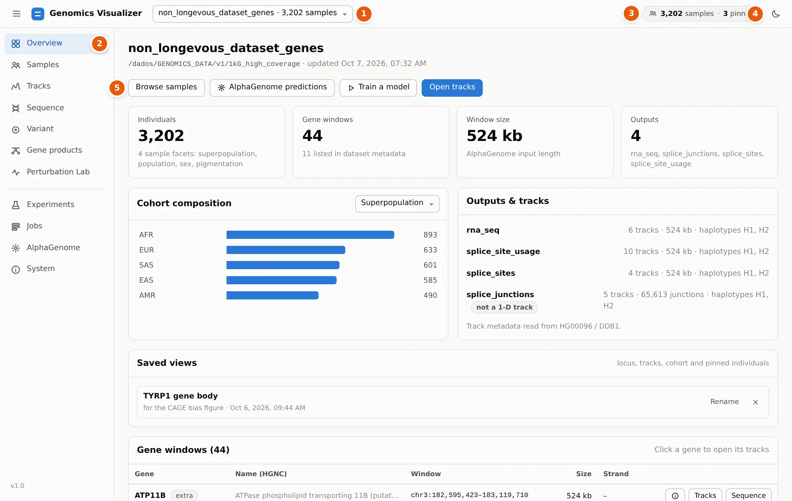

# Visualizer Tutorial

`genomics visualize` is one local web app over a cohort's genomes and their AlphaGenome
predictions. This tutorial goes through its pages in the order a question naturally takes you
through them. Each step is short, shows what you should see, and says how to read it.

```bash
genomics visualize --open      # http://localhost:8780/
```

## The running example

All screenshots come from the 1000 Genomes high-coverage dataset (`1kg_high_coverage`): 3,202
genomes from 26 populations, 44 gene windows of 524 kb, and AlphaGenome RNA-seq for three skin cell
types. The 11 windows listed in the dataset's metadata are pigmentation genes (OCA2, HERC2, TYR,
TYRP1, MC1R, SLC24A5, SLC45A2, …). The other 33 are control genes.

We follow one individual, **HG00096** (British, GBR), and one question:

> *What does HG00096's genome change about their pigmentation genes, and how far can we trust the
> prediction?*



| Step | Page | You will learn to |
|---|---|---|
| [1. Open a dataset](overview.md) | Overview | read a dataset at a glance, open gene cards, restore saved views |
| [2. Build a cohort](samples.md) | Samples | filter and pin samples, check ancestry with a PCA, define per-sample scalars |
| [3. Read predicted tracks](tracks.md) | Tracks | compare individuals, groups and the whole cohort with the reference genome and observed data, and export figures |
| [4. Compare haplotypes](sequence.md) | Sequence | see each haplotype's bases and variants against the reference |
| [5. Test a variant](variant.md) | Variant | check a variant's predicted effect against GTEx |
| [6. From DNA to protein](gene-products.md) | Gene products | follow one individual's two copies of a gene into mRNA, protein and structure |
| [7. Train and evaluate models](experiments.md) | Experiments | train from a form, read runs, and add negative controls |
| [8. Ask the model why](perturbation-lab.md) | Perturbation Lab | edit a genome in silico and see what the model reads |
| [9. Jobs, AlphaGenome, System](running-work.md) | Jobs · AlphaGenome · System | run predictions, choose a backend, check the machine |
| [10. Bring your own cohort](import.md) | Import dataset | build a dataset from any phased VCF |
| [11. From a notebook](notebook.md) | – | get the same arrays in Python |

You can read the steps in any order. Steps 1–6 need only a dataset. Steps 7–8 need the `[genotype]`
extra (PyTorch), and step 8 also needs an AlphaGenome backend.

## The app at a glance

<figure markdown="span">
  
  <figcaption>The app shell. The numbers match the list below.</figcaption>
</figure>

<span class="callout">1</span> **Dataset switcher.** Every open dataset (registered, opened by
path, or imported). Switching keeps a separate cohort, pins and locus per dataset.

<span class="callout">2</span> **Pages.** The upper group explores data: Overview, Samples,
Tracks, Sequence, Variant, Gene products, Perturbation Lab. The lower group runs work:
Experiments, Jobs, AlphaGenome, System.

<span class="callout">3</span> **Cohort chip.** How many samples pass the Samples-page filters, and
how many individuals are pinned. Click it to edit the cohort. The cohort and the pins are shared by
every page.

<span class="callout">4</span> **Theme.** Light or dark. Figure export can always use a light
background.

<span class="callout">5</span> **Page actions.** Each page's main actions sit under its title.

## Habits that help

- **Links are shareable.** The URL holds the page and its main parameters, e.g.
  `#/products?gene=MC1R&sample=HG00096&tissue=CL:1000458`.
- **Names are clickable.** A gene name opens a gene card (HGNC, Ensembl, UniProt, GTEx, ClinVar,
  Gene Ontology…). A track name opens a track card (ontology term, assay, the ENCODE / FANTOM5
  experiments behind it). Ontology CURIEs and sample IDs link to OLS and IGSR.
- **Long work does not block you.** Cohort-wide computations show a progress card and keep running
  if you leave the page. Their results are cached on disk, so the second time is instant.
- **Plots respond to the keyboard and mouse.** Drag to pan, <kbd>Ctrl</kbd>/<kbd>⌘</kbd>+scroll
  to zoom, <kbd>Shift</kbd>+drag to zoom to a region, double-click to zoom in, and use
  <kbd>←</kbd> <kbd>→</kbd> <kbd>+</kbd> <kbd>−</kbd> on the focused plot.
- **The locus box understands genes and rsIDs.** Type `chr15:28120402-28120541`, `TYRP1` or
  `rs12913832`.

Every control is described in full in the [Visualizer reference](reference.md).

[Start: open a dataset :octicons-arrow-right-24:](overview.md){ .md-button .md-button--primary }
