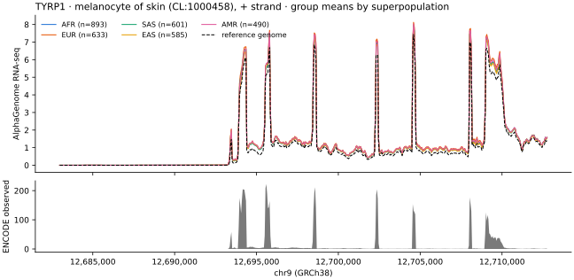

# 11. From A Notebook

**Goal:** get exactly the arrays the app draws into Python, for statistics or custom figures,
without re-implementing window resolution, track matching, haplotype remapping or group aggregation.

`genomics.visualizer.client` talks to a running app. It needs only the standard library and numpy,
and it waits on the background jobs that the heavier requests start.

```python
from genomics.visualizer.client import Visualizer

v = Visualizer("http://127.0.0.1:8780", dataset="1kg_high_coverage")
start, end = 247_235, 277_052                   # TYRP1 gene body (window offsets)

means = v.group_means("TYRP1", "rna_seq", field="superpopulation", tracks=[1], start=start, end=end, bins=600)
ref = v.reference_signal("TYRP1", "rna_seq", tracks=[1], start=start, end=end, bins=600)
obs = v.observed("TYRP1", "rna_seq", tracks=[1], start=start, end=end, bins=600)

means["edges"]                                  # bin edges (bins + 1,)
means["groups"][0]["group"], means["groups"][0]["mean"]   # 'AFR', array (tracks, bins)
obs["tracks"][0]["provider"], obs["tracks"][0]["mean"]    # 'ENCODE', array (bins,)
```

A dozen lines of matplotlib on those arrays give this figure:

<figure markdown="span">
  { width="860" }
  <figcaption>Made in a notebook from <code>group_means</code>, <code>reference_signal</code> and
  <code>observed</code>. These are the numbers behind the Tracks views of
  <a href="../tracks/">step 3</a>.</figcaption>
</figure>

You don't have to write these calls by hand. On the Tracks page, **Export → Copy as Python**
copies the call for the view on screen, with its gene, tracks, range, binning, haplotypes or groups
and cohort filters filled in.

| Method | Returns |
|---|---|
| `datasets`, `summary`, `genes`, `samples`, `cohort` | the dataset, its windows and its sample table (with region scalars and PC fields). `samples()` is a pandas DataFrame when pandas is installed |
| `signal`, `reference_signal`, `observed` | per-haplotype predictions, the reference-window prediction, and the measured ENCODE / FANTOM5 signal |
| `group_means` | mean ± SD per group of a sample field over the cohort |
| `variant_sites`, `variant_effect`, `genotypes` | cohort sites, the in-silico eQTL at one site, genotype counts |
| `scalars`, `pca` | region-scalar definitions and the genotype PCA |
| `sessions`, `session` | saved views, to reproduce a figure's exact view |
| `products`, `products_fasta`, `report`, `expression` | the Gene products page: transcripts and proteins per haplotype, its report, and mRNA/protein against the reference per tissue |

That is the end of the tour. From here:

- the [Visualizer reference](reference.md) describes every control, data source and computation;
- [From genome to function](../approach/index.md) explains the reasoning behind the pages;
- [Pipelines](../components/index.md) covers the command-line side.
