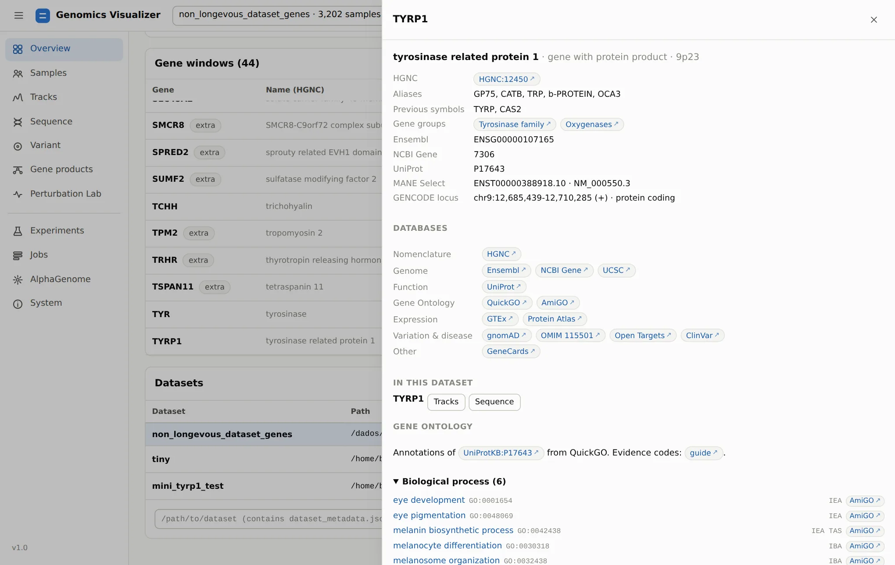

# 1. Open A Dataset

**Page:** Overview · **Goal:** know what the dataset contains before asking it anything.

Start the app and pick the dataset in the switcher at the top. The Overview is its summary page.

<figure markdown="span">
  
  <figcaption>Overview of <code>1kg_high_coverage</code>: 3,202 individuals, 44 windows of 524 kb,
  four AlphaGenome outputs.</figcaption>
</figure>

## Read the summary cards

| Card | What it tells you |
|---|---|
| **Individuals** | Samples with data, and the **sample facets**: every column of the pedigree or of your metadata becomes a field to filter, group or train on (here superpopulation, population, sex, pigmentation) |
| **Gene windows** | How many windows there are, and how many are listed in the dataset metadata (the genes the dataset was built for). The rest are marked **extra**. In this dataset they are control genes |
| **Window size** | AlphaGenome's input length for every window |
| **Outputs** | Which AlphaGenome outputs have been predicted (here RNA-seq and three splicing outputs) |

**Cohort composition** counts the samples by any field. **Outputs & tracks** lists each output's
tracks and haplotypes. `splice_junctions` is *not a 1-D track*: it is a junction list, which the
[Gene products](gene-products.md) page uses.

## Look a gene up

The **Gene windows** table lists every window with its HGNC name and coordinates. Click a gene
name, or the ⓘ button, to open its **gene card**:

<figure markdown="span">
  
  <figcaption>The TYRP1 gene card: HGNC name, aliases (OCA3), MANE Select transcript, links to 14
  databases, the dataset's windows and the Gene Ontology annotations from QuickGO.</figcaption>
</figure>

Gene cards open from every page that names a gene. They are the quickest way to go from a symbol
to Ensembl, UniProt, GTEx, gnomAD, OMIM, ClinVar or Open Targets.

## Come back to saved views

**Saved views** lists the views saved from the Tracks page. Each one stores a locus, its tracks and
their order, the display mode, the cohort filters and the pinned individuals. Clicking one restores
all of it. Saved views are kept on disk (`~/.config/genomics/visualizer_sessions.json`), so they
survive a cleared browser and move with the dataset path. You will save one in
[step 3](tracks.md#save-the-view-export-the-figure).

## Open or switch datasets

Further down, **Datasets** lists every dataset the app knows. Paste the path of any directory with
a `dataset_metadata.json` to open it while the app runs. Imported datasets are added here
automatically. From the command line:

```bash
genomics visualize --dataset /path/to/dataset --open
genomics visualize --dataset-id 1kg_high_coverage --annotations phenotypes.tsv   # extra sample columns
```

## Start work from here

The buttons under the title are shortcuts. **Browse samples** opens step 2, and **Open tracks**
opens step 3. **AlphaGenome predictions** and **Train a model** open the forms described in
[step 9](running-work.md) and [step 7](experiments.md).

[Next: build a cohort :octicons-arrow-right-24:](samples.md){ .md-button }
