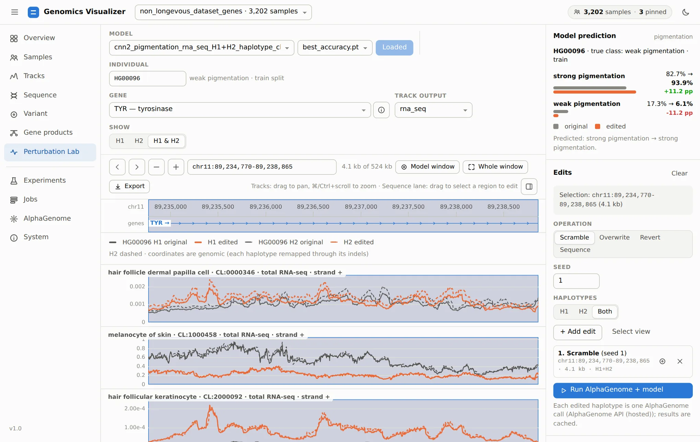
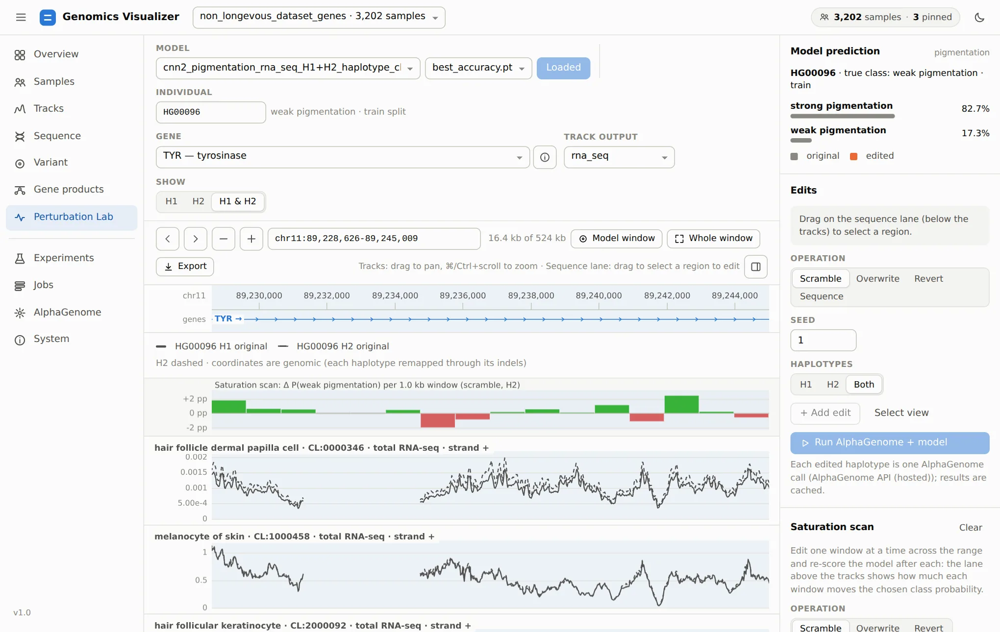

# 8. Ask The Model Why

**Page:** Perturbation Lab · **Goal:** find out which part of a genome a trained model relies on, by
editing that genome in silico and watching the prediction move.

Needs a trained run (step 7), the `[genotype]` extra, and an AlphaGenome backend
([step 9](running-work.md#choose-the-alphagenome-backend)).

## Load a model and an individual

Pick a **run** and a checkpoint and click **Load model**. You can also open a run from the
Experiments page with **Perturbation Lab**. The lab scores individuals through the run's own window
processing and saved normalization (its processed cache must still exist). Choose
an **individual** (its true class and split are shown) and a **gene** among the run's windows.

## Edit, re-predict, re-score

<figure markdown="span">
  
  <figcaption>4.1 kb inside TYR scrambled on both of HG00096's copies. The grey lines are the
  original predictions and the orange lines the edited ones. The model's probabilities before and
  after are on the right.</figcaption>
</figure>

1. **Select a region**: drag on the sequence lane, or zoom to it and click **Select view**.
2. Choose an **operation** and the **haplotypes** (H1, H2, both), then click **+ Add edit**. Several
   edits can be combined.

    | Operation | Effect |
    |---|---|
    | Scramble | Shuffle the region's bases (seeded): keeps the composition, destroys motifs |
    | Overwrite | Every base becomes A, C, G, T or N |
    | Revert | Bases aligned to the reference return to it: removes the individual's SNVs (indels stay) |
    | Sequence | Replace the region with your own sequence of the same length |

3. **Run AlphaGenome + model** re-predicts each edited haplotype (one AlphaGenome call each, cached
   by sequence), rebuilds the model input and shows every class probability before → after.

Edits keep each haplotype's length, so the edited predictions line up base for base with the
originals. Selections are on the genomic axis and reach each haplotype through its own indels. In
the example, scrambling 4.1 kb of TYR lowers the predicted melanocyte RNA-seq over it, and the
model's *strong pigmentation* probability rises by 11 points. The edit matters to the model, and
the direction tells you which class that stretch's signal supports.

!!! note "Gaps in the tracks"
    The blank stretch in the tracks is not missing data. Both of HG00096's copies carry a
    structural deletion that starts there (chr11:89,231,317, see
    [step 6](gene-products.md#2-the-individuals-two-copies)), and in genomic coordinates deleted
    bases are drawn as gaps.

**Revert** is the most useful operation for causal questions. Reverting a region to the reference
asks how much of the prediction comes from this individual's variants there. Reverting a single SNV
asks what that variant alone does. That is the per-base complement of the cohort association on
the [Variant page](variant.md).

## Saturation scan

Instead of guessing where to edit, let the lab try every window:

<figure markdown="span">
  
  <figcaption>Scramble, 1 kb windows, tiled across 16 kb of TYR on H2. Each bar is how much
  scrambling that window moves P(weak pigmentation): green up, red down.</figcaption>
</figure>

The **Saturation scan** section slides one edit (scramble, overwrite or revert) across the model
window, the view or the selection. You set the window size and step (step = window gives tiled
windows, a smaller step gives overlapping ones) and the haplotypes. The scan runs as a background
job of at most 256 windows, each one AlphaGenome call per edited haplotype. Windows where the edit
changes nothing, such as reverting a stretch without variants, are skipped. The list beside it ranks
the windows with the largest effect. **Show** zooms to one, and **+** adds it as an edit so **Run**
shows its tracks. **Download TSV** saves every window.

Here no single kilobase moves the prediction by more than about 3 points, so no sharp element in
this stretch drives the call. A model that relied on a few causal sites would show a few tall,
isolated bars. A flat profile like this one points to signal spread across the window, which is
also what you would expect if the model had learned ancestry, as
[step 2](samples.md#ancestry-pca-and-matching) warns.

[Next: jobs, AlphaGenome and system :octicons-arrow-right-24:](running-work.md){ .md-button }
