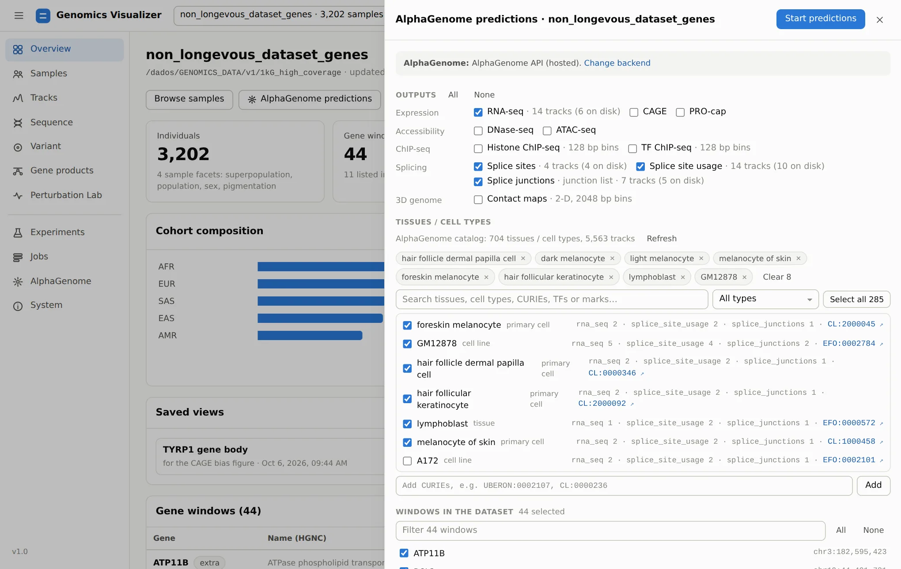
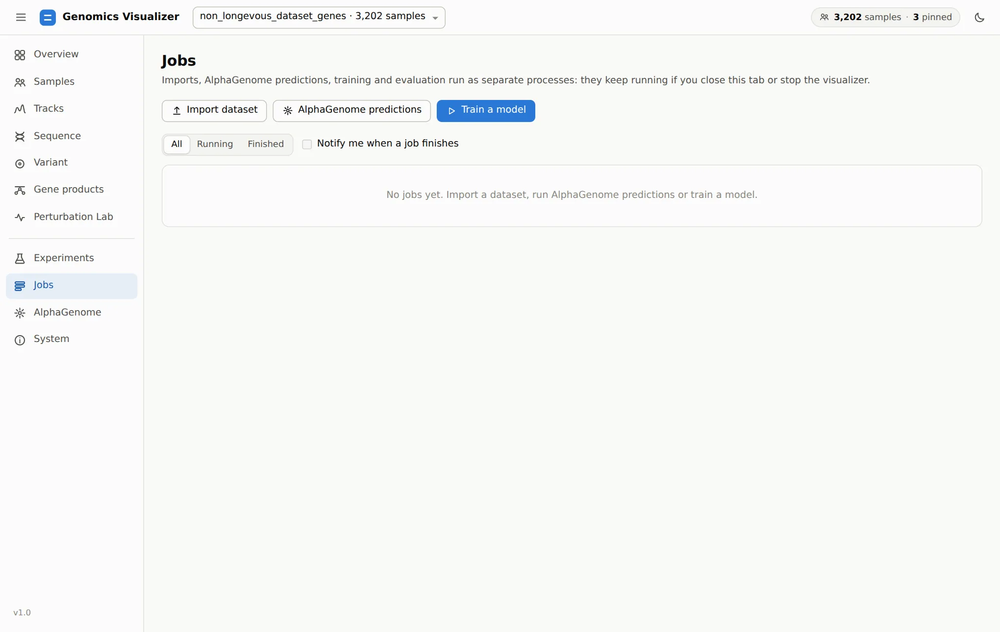
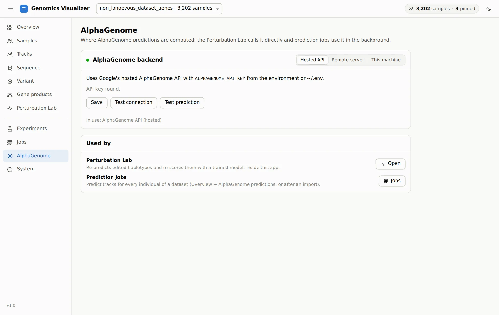

# 9. Jobs, AlphaGenome, System

**Pages:** Jobs · AlphaGenome · System · **Goal:** produce new data (predictions, imports,
training runs) and know what this machine can do.

## Predict new tracks

**Overview → AlphaGenome predictions** (or the same button on Jobs) opens the prediction form:

<figure markdown="span">
  
  <figcaption>The prediction form. Choose outputs, tissues and cell types from the AlphaGenome catalog
  (704 terms, 5,563 tracks), samples, windows and haplotypes. It estimates tracks and disk use
  before you start.</figcaption>
</figure>

- **Outputs**: every AlphaGenome output, with how many tracks already exist on disk. Splice
  junctions feed the [Gene products](gene-products.md) splicing card.
- **Tissues / cell types**: searchable by name, CURIE, TF or histone mark, and filterable by
  biosample type. Only terms with tracks for the chosen outputs are listed.
- **Samples**: all, the Samples-page cohort, or the pinned individuals. **Haplotypes** include
  `ref`, the reference genome baseline.
- **Windows**: existing windows, any GENCODE gene, custom `NAME=chr:start-end` regions, curated
  regulatory elements (pigmentation enhancers near OCA2, KITLG, IRF4; classic loci such as LCT,
  FTO/IRX3, 9p21), or **the genes of a Gene Ontology term or HGNC gene group**. New windows are first
  built for every sample from the dataset's source VCF.

Windows that already have the outputs are skipped unless *overwrite* is set. The CLI equivalent is
`genomics alphagenome predict-dataset`.

!!! info "Cost"
    One AlphaGenome call per sample × haplotype × window: about 4 s on the hosted API and about
    0.8 s on a local GPU for a 524 kb window. A whole 1000 Genomes window set (3,202 × 2 × 44 calls)
    is days of compute, so predict the cohort you need, not the whole dataset. See
    [Requirements](../getting-started/requirements.md#compute).

## Follow jobs

<figure markdown="span">
  
  <figcaption>Jobs: imports, AlphaGenome predictions, training and evaluation.</figcaption>
</figure>

Jobs run as **separate processes**, so they survive closing the tab and stopping the app. A
restarted app lists them again. Each job shows progress, an ETA and a live log, and can be
cancelled. **Retry** re-runs a finished job with the same recipe. Each job folder
(`results/visualizer/jobs/<id>/`) keeps `task.json` with the exact commands, so any job can also be
re-run from a shell. Training and evaluation share a `gpu` queue, and predictions an `alphagenome`
queue. Each queue runs one job at a time.

The top bar shows running jobs from every page. **Notify me when a job finishes** adds a desktop
notification for when the tab is in the background.

## Choose the AlphaGenome backend

<figure markdown="span">
  
  <figcaption>The AlphaGenome page: where prediction jobs and the Perturbation Lab send their
  calls.</figcaption>
</figure>

| Mode | Use when | Needs |
|---|---|---|
| **Hosted API** | You have no GPU, or want to start now | `ALPHAGENOME_API_KEY` in the environment or `~/.env` |
| **Remote server** | Another machine serves the model | Its address, e.g. `grpc://10.0.0.5:50051` (and a CA certificate for self-signed TLS) |
| **This machine** | You have an NVIDIA GPU and want privacy and no quotas | `genomics alphagenome server setup` once. Then **Start server** here, which shows loading → ready |

**Test connection** checks the service. **Test prediction** runs a 16 kb prediction, which proves
the model runs (on a fresh local server the first call includes JIT compilation). A job keeps the
backend it started with. Details:
[Visualizer reference](reference.md#alphagenome-backend).

## Check the machine

<figure markdown="span">
  
  <figcaption>System: the same report as <code>genomics doctor</code>, feature by feature, plus
  hardware and free disk space wherever the app writes.</figcaption>
</figure>

When something is greyed out elsewhere in the app, the System page says what is missing and the
command that adds it.

[Next: bring your own cohort :octicons-arrow-right-24:](import.md){ .md-button }
