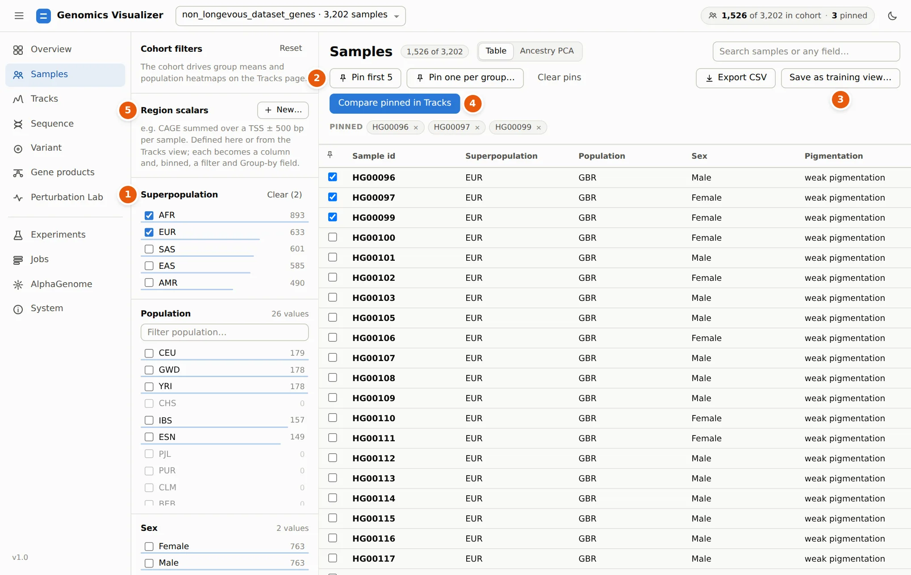
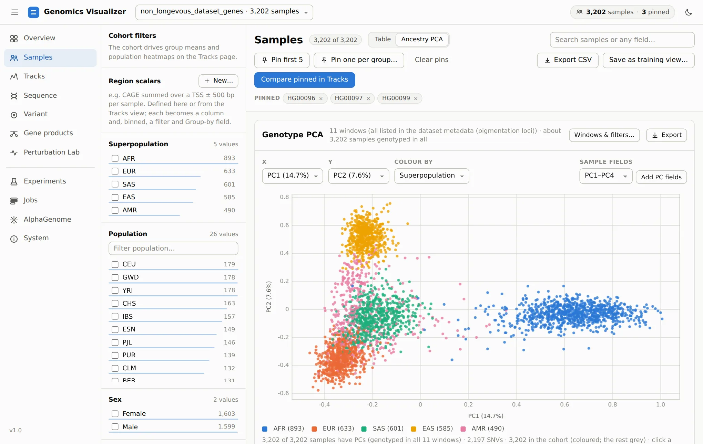
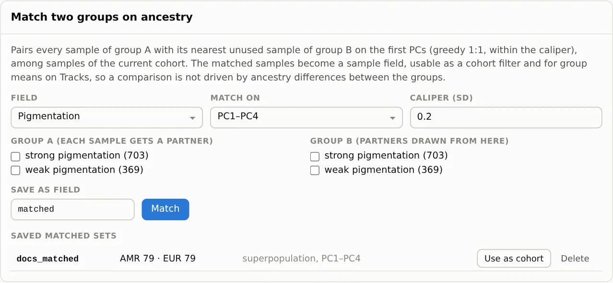
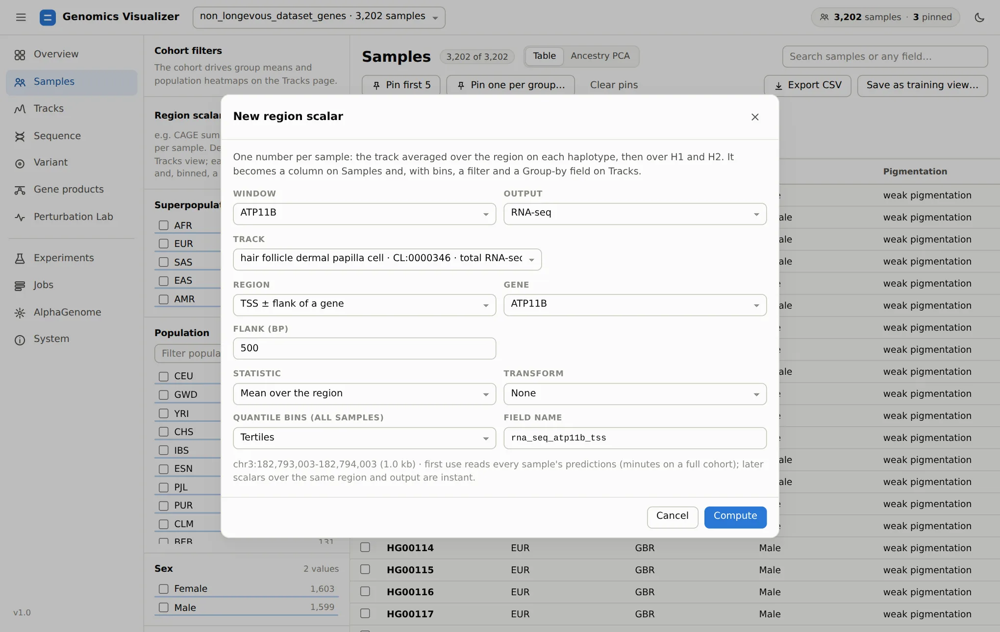

# 2. Build A Cohort

**Page:** Samples · **Goal:** choose who to look at, and check whether the groups you compare
differ in ancestry.

Two selections on this page drive the rest of the app:

- the **cohort**: every sample that passes the filters. Group means, population heatmaps, region
  scalars and training all use it.
- the **pinned** individuals (up to 32): shown one by one on Tracks, Sequence and in the
  Perturbation Lab.

<figure markdown="span">
  
  <figcaption>Superpopulation filtered to AFR and EUR (1,526 of 3,202 samples), with HG00096,
  HG00097 and HG00099 pinned.</figcaption>
</figure>

## Filter the cohort

1 Each **facet** in the left column is a sample field with its
values and counts. Tick values to keep them. Counts in the other facets update with every click,
so you can see, for example, that the AFR + EUR cohort has no CHS samples. Within a facet, values
are combined with OR. Across facets they are combined with AND. The count next to the title says
how many samples the cohort has, and free-text **search** matches any field.

## Pin individuals

Tick the box in a row to pin that sample. 2 **Pin first 5** and **Pin
one per group…** (one sample per value of a field, e.g. one per population) are quick ways to build
a comparison panel. The pinned
chips under the buttons remove a pin. 4 **Compare pinned in Tracks**
jumps to step 3 with them.

In the tutorial we keep **HG00096**, a British man labelled *weak pigmentation*, with two other
GBR samples.

## Save a cohort for training

3 **Save as training view…** writes the cohort (and what it is for) as
a `.view.json` file. A training config can point to that file, so the run uses exactly these
samples. **Export CSV** saves the table with every field.

## Ancestry PCA and matching

Switch the page from **Table** to **Ancestry PCA**. The first time, click **Compute PCA**. It reads
every sample's window VCFs (seconds per window) and caches the result.

<figure markdown="span">
  
  <figcaption>PCA of 2,197 common SNVs from the 11 pigmentation windows. PC1 separates African
  from non-African genomes, and PC2 separates East Asian from European genomes.</figcaption>
</figure>

The PCA uses biallelic SNVs with minor-allele frequency ≥ 5%, thinned to one per 2 kb, and the
genetic relationship matrix, as EIGENSOFT does. **Colour by** any field, choose any pair of PCs,
and click a point to pin that sample. **Add PC fields** turns `pc1`…`pcK` into numeric sample
fields, for tables, CSV export or as covariates.

**Matching** answers a question every comparison of groups should ask first: *are there people in
both groups with the same genetic background?* Choose a field, the values for group A and group
B, the number of PCs and a caliper. Each A sample is then paired with its nearest unused B sample.

<figure markdown="span">
  
  <figcaption>AMR vs EUR on PC1–PC4 at a 0.2 SD caliper gives 79 pairs. The matched samples become
  a sample field, usable as a cohort or as groups on Tracks.</figcaption>
</figure>

Now try the pigmentation labels: group A *weak pigmentation*, group B *strong pigmentation*. The
app answers **"No pairs within the caliper"**. Weak (European) and strong (African) samples are
10.4 pooled SDs apart on PC1, and no genome in one group resembles any genome in the other. That
single result shapes everything after it. A model that separates these labels may be learning
ancestry, not pigmentation, so [step 7](experiments.md#negative-controls) adds the controls that
can tell the two apart.

!!! note "Which windows the PCA uses"
    By default, the PCA uses the windows that cover the most samples, preferring control windows.
    In this dataset the control windows have VCFs for only 1,072 samples, so it falls back to the
    11 pigmentation windows, which cover all 3,202. **Windows & filters…** changes the windows,
    MAF, spacing and number of components.

## Region scalars: a track as a sample field

5 **Region scalars → New…** turns predicted signal into one number
per sample: the mean of a track over a region (a gene's TSS ± a flank, its body, or any range),
averaged over H1 and H2, optionally summed and log-transformed.

<figure markdown="span">
  { width="760" }
  <figcaption>A region scalar: one track over one region, per sample, optionally binned into
  quantiles.</figcaption>
</figure>

The scalar becomes a numeric column. With bins, it also becomes a categorical field (`Q1` … `Qk`),
so you can filter the cohort to the samples with the highest predicted TYRP1 expression, or split
group means by it on Tracks. The first computation reads every sample's predictions for that output
(about 20 s for 3,202 samples); other tracks of the same output and region are then instant.

[Next: read predicted tracks :octicons-arrow-right-24:](tracks.md){ .md-button }
