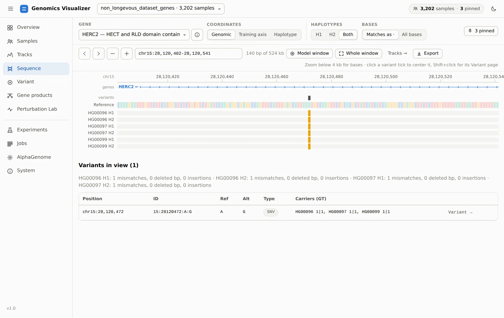
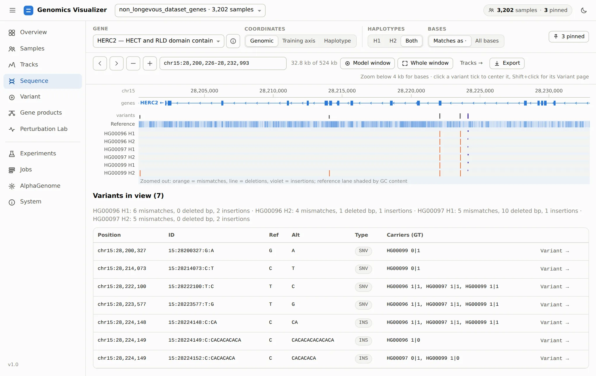

# 4. Compare Haplotypes

**Page:** Sequence · **Goal:** see the bases behind a prediction: which variants each pinned
haplotype carries, and where.

Tracks tell you *that* the haplotypes differ. The Sequence page shows *how*. Open it from **Tracks →
Sequence →** (it keeps the locus), or directly. We move to the HERC2 window, which holds the
best-known pigmentation regulatory variant, **rs12913832**. It sits in a HERC2 intron, in an
enhancer of the neighbouring OCA2.

## Zoomed in: bases

Type `rs12913832` in the locus box (or `chr15:28120402-28120541`):

<figure markdown="span">
  
  <figcaption>140 bp around rs12913832. Every pinned haplotype carries the G allele (orange): all
  three GBR individuals are homozygous <code>1|1</code>.</figcaption>
</figure>

Below 4 kb the page draws bases. The **Reference** row is coloured by base. Each haplotype row
shows only what differs (**Matches as ·**) or every base (**All bases**). Mismatches are coloured,
and deletions and insertions are marked. The **variants** lane marks every site in view. Click a tick
to centre it, or <kbd>Shift</kbd>+click it to open its [Variant page](variant.md).

**Variants in view** lists the sites with their alleles, type and each pinned sample's phased
genotype (`1|1`, `0|1`…). **Variant →** opens the site on the Variant page, which is where we go next.

## Zoomed out: density

Click **Model window** to see the 32 kb the models read:

<figure markdown="span">
  
  <figcaption>The HERC2 model window. Orange ticks are mismatches, lines are deletions and violet
  ticks are insertions. The reference lane is shaded by GC content.</figcaption>
</figure>

The summary line counts each haplotype's mismatches, deleted bases and insertions in view. This is
the quickest way to see why two people's tracks diverge in a region, or to find a haplotype with an
indel that shifts positions downstream.

## Coordinates

The same three modes as on Tracks. **Genomic** lines haplotypes up on reference positions, with
deletions as gaps. **Haplotype** shows each sequence as AlphaGenome saw it. **Training axis** shows
the shared alignment with insertion columns that the CNN models use. The training axis is built
with bcftools on first use and cached. See
[Dynamic Indel Tensor Alignment](../concepts/dynamic-indel-tensor-alignment.md) for why it exists.

[Next: test a variant :octicons-arrow-right-24:](variant.md){ .md-button }
