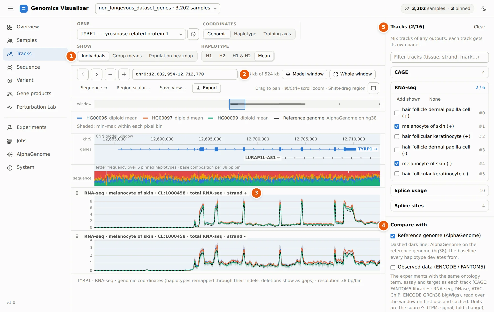
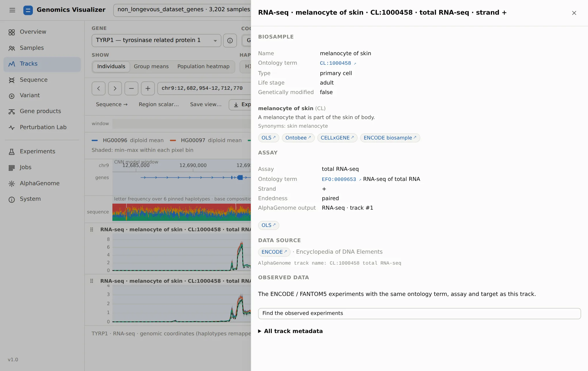
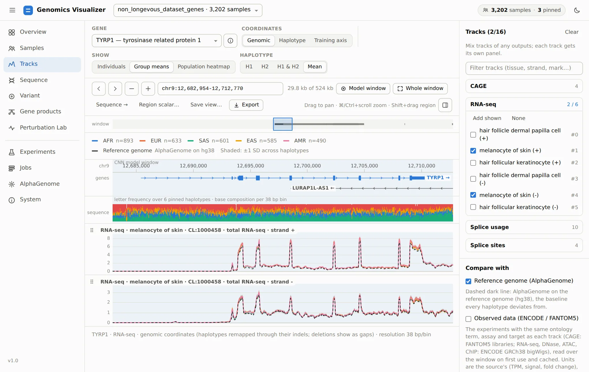
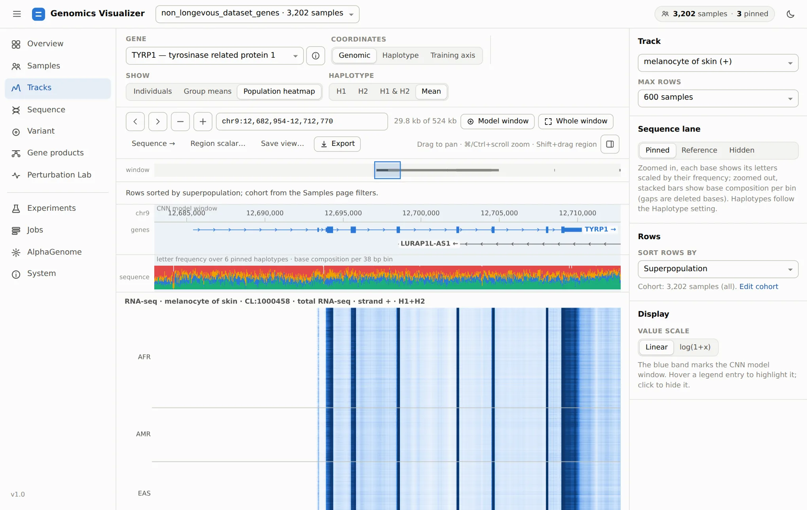
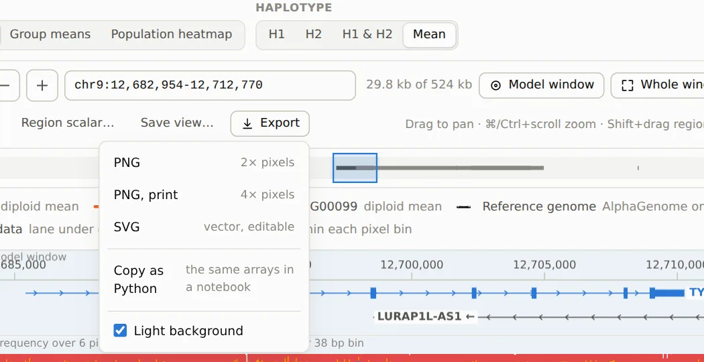
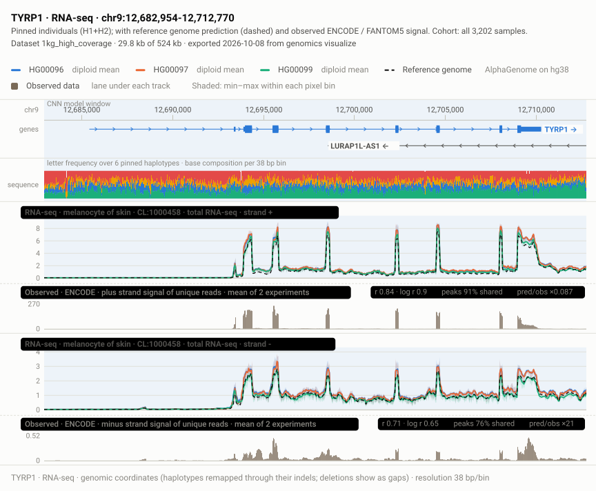

# 3. Read Predicted Tracks

**Page:** Tracks · **Goal:** see what AlphaGenome predicts for each individual, and judge it against
the reference genome and against measured data.

Go to **Tracks** (or **Compare pinned in Tracks** on the Samples page), choose **TYRP1** in the gene
box and tick the two *melanocyte of skin* RNA-seq tracks in the right-hand panel.

<figure markdown="span">
  
  <figcaption>Three pinned individuals' predicted melanocyte RNA-seq over TYRP1, + and − strand.
  The dashed line is AlphaGenome's prediction for the reference genome.</figcaption>
</figure>

1 **Show** chooses what each panel draws: pinned **individuals**,
**group means** of the cohort, or a **population heatmap**. **Haplotype** draws H1, H2, both,
or their mean.

2 **The locus box** takes coordinates, a gene name or an rsID.
**Model window** jumps to the 32 kb the CNN models read (the blue band). **Whole window** shows
all 524 kb, and the strip under the buttons shows where you are in it.

3 **One panel per track.** The panel title shows the output,
biosample, ontology term, assay and strand. Click the title for the **track card**, and drag the
⋮⋮ grip to reorder panels. Above the panels are the gene models (click one for its gene card) and
a sequence lane with the base composition of the pinned haplotypes. Zoomed in, the lane shows the
letters themselves.

4 **Compare with** adds the two references every prediction should
be read against (next section).

5 **Tracks** lists every output and track in the dataset. Mix up to
16 tracks of any outputs (RNA-seq, CAGE, DNase, ChIP…) and filter them by tissue, strand or mark.

!!! tip "Reading the plot"
    The three individuals' predictions almost coincide, and all sit slightly above the reference
    genome on the exons. For a gene like TYRP1 that is typical: common variants shift expression a
    little, and the differences between people are much smaller than the gene's exon structure.
    Look for **where** lines separate (an exon, the promoter, a single peak), not for whole-gene
    offsets.

## Compare with the reference and with observed data

Tick **Observed data (ENCODE / FANTOM5)**. Under each track the app now draws the experiment
AlphaGenome was trained on for that track, matched by ontology term, assay and target, in the
source's own units:

<figure markdown="span">
  
  <figcaption>Observed lanes (grey) under each predicted track. The badge on the right compares
  prediction and observation over the bins in view.</figcaption>
</figure>

The **agreement badge** reads like this:

| Badge entry | Meaning | Here (+ strand) |
|---|---|---|
| `r` / `log r` | Pearson correlation of predicted and observed values, raw and log(1 + x) | 0.84 / 0.90 |
| `peaks … shared` | Share of the observed top-decile bins that are also predicted top-decile bins | 91% |
| `pred/obs` | Ratio of the means. It is only meaningful when units match (FANTOM5 CAGE in TPM), and is flagged beyond 4× | ×0.087 (different units) |

The minus-strand lane agrees less well (log r 0.65). The observed minus-strand signal here is small
(0.5 vs 270 on the plus strand), which is what you expect for a plus-strand gene, so its
correlation says little. Zoom to an exon or the promoter to judge a prediction locally: the
statistics follow the view.

!!! info "Where it does not agree"
    The same comparison for melanocyte **CAGE** over TYRP1 finds the predicted TSS peaks exactly
    where FANTOM5 measures them, but about 4.5× too high. That is why the app shows both lanes rather
    than trusting either alone. Sources and matching rules are listed in the
    [reference](reference.md#reference-and-observed-data).

**Reference genome (AlphaGenome)** is the dashed line. If a dataset has no reference prediction
yet, **Predict the reference…** starts the job (one AlphaGenome call per window).

## Track cards

Click a panel title to see what the track actually is:

<figure markdown="span">
  
  <figcaption>Track card for melanocyte RNA-seq. It shows the CL term with its definition, the assay's
  EFO term, ENCODE as the source, and links to OLS, Ontobee, CELLxGENE and the experiments.</figcaption>
</figure>

## From individuals to the whole cohort

**Group means** draws the mean ± SD of every group of a sample field, over the cohort from step 2.
Here the cohort is all 3,202 samples, grouped by superpopulation:

<figure markdown="span">
  
  <figcaption>Group means by superpopulation (6,404 haplotypes). The first computation takes
  about a minute and is then cached on disk.</figcaption>
</figure>

The five superpopulations are nearly indistinguishable over TYRP1, so AlphaGenome predicts no large
population-level difference in TYRP1 expression in melanocytes. **Show difference from cohort mean**
replots each group as its deviation, which makes small differences visible. Any categorical field
works as the grouping: pigmentation, sex, a region-scalar bin, a matched set from the
[ancestry matching](samples.md#ancestry-pca-and-matching), or the genotype at a variant (set from
the [Variant page](variant.md)).

**Population heatmap** draws one row per sample, sorted by a field, for one track:

<figure markdown="span">
  
  <figcaption>Population heatmap of melanocyte RNA-seq (+) over TYRP1. Each row is one sample,
  grouped by superpopulation. Exons appear as dark columns, and a sample that differs shows up
  as a streak.</figcaption>
</figure>

## Coordinates

AlphaGenome predicts each haplotype on its own sequence, so position *i* of a prediction is
position *i* of that haplotype. **Coordinates** chooses how to line them up:

| Mode | Use it to |
|---|---|
| **Genomic** (default) | Compare people at the same reference positions. Each haplotype is remapped through its own indels, and deleted bases are gaps |
| **Haplotype** | See the raw prediction index |
| **Training axis** | See exactly what the CNN models read (the shared alignment with insertion columns) |

## Save the view, export the figure

**Save view…** stores the locus, tracks and their order, the mode, the compare lanes, the cohort
and the pins under a name. It is listed on the [Overview](overview.md#come-back-to-saved-views).

**Export** downloads the view as a figure:

<figure markdown="span">
  { width="600" }
</figure>

The **SVG** is vector: plots are redrawn as paths and text, ready for Inkscape or Illustrator.
Only the heatmap and the sequence lane stay bitmaps. The figure carries its own caption with the
gene, locus, outputs, what is shown, the cohort, the dataset and the date. This is the figure
exported from the view above, unedited:

<figure markdown="span">
  { width="860" }
  <figcaption>SVG exported by <em>Export → SVG</em> from the observed-data view.</figcaption>
</figure>

**Copy as Python** copies the [notebook client](notebook.md) call that returns the arrays of this
exact view.

## Other controls worth knowing

- **Y-axis**: linear or log(1+x), **Same y-scale for all tracks**, and **Lock y-scale while
  panning**, so a quiet region looks quiet instead of being stretched to fill the panel.
- **Region scalar…** turns the view's track and range into a per-sample field (see
  [step 2](samples.md#region-scalars-a-track-as-a-sample-field)).
- **Sequence →** opens the same locus on the Sequence page, which is the next step.

[Next: compare haplotypes :octicons-arrow-right-24:](sequence.md){ .md-button }
