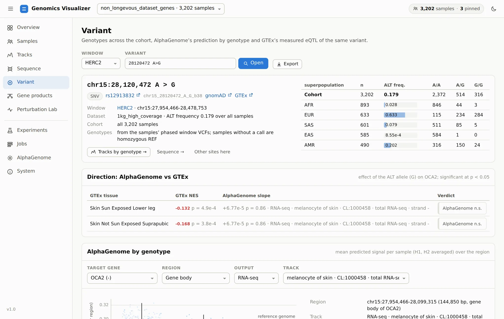
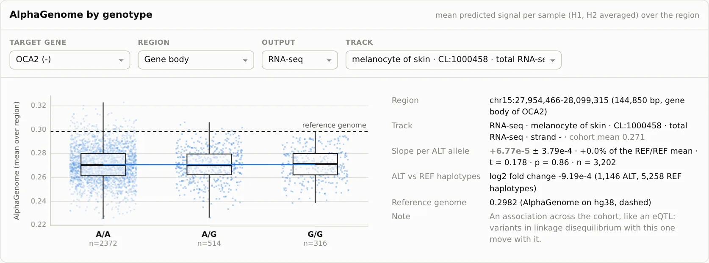
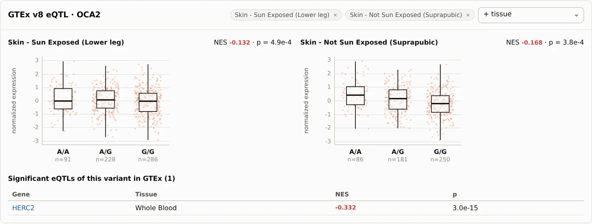
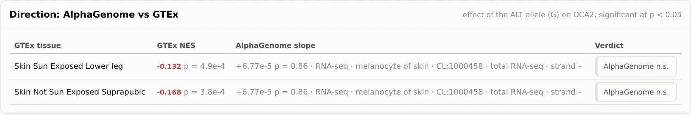

# 5. Test A Variant

**Page:** Variant · **Goal:** take one site across the whole cohort. Who carries it, does
AlphaGenome predict that it changes expression, and does GTEx, which measured expression in real
people, agree?

Open **Variant →** from the Sequence page, or type a variant on the Variant page: an rsID, a
position, `chr15:28120472 A>G` or a GTEx ID (`chr15_28120472_A_G_b38`). With no variant, the page
lists the window's common sites.

## Who carries it

<figure markdown="span">
  
  <figcaption>rs12913832 across 3,202 genomes: the G allele is at 63% in Europeans and under 3% in
  Africans.</figcaption>
</figure>

The header links the variant to dbSNP, gnomAD and GTEx, and counts genotypes in the cohort and by
any field (superpopulation by default). Genotypes come from each sample's phased window VCF, read
once per window in parallel and cached (a few seconds for 3,202 samples).

**Tracks by genotype →** opens the Tracks page with group means split by the genotype at this site.
It is the visual version of the next card.

## Does AlphaGenome predict an effect?

<figure markdown="span">
  
  <figcaption>Each point is one genome's predicted melanocyte RNA-seq over the OCA2 gene body (H1
  and H2 averaged), by genotype at rs12913832. The blue line is the regression, and the dashed line
  is the reference genome.</figcaption>
</figure>

This is an **in-silico eQTL**: every genome's prediction, grouped by genotype, with an ordinary
least-squares slope per ALT allele. Choose the **target gene**, the **region** (gene body, promoter
TSS ± 1 kb, the variant ± 1 kb, or custom), the output and the track. By default the track is the
one with the highest signal on the target gene's strand.

Here the slope is +6.8 × 10⁻⁵ per G allele (p = 0.86): **no predicted effect**.

!!! warning "What this slope is, and is not"
    It is an association across the cohort, like an eQTL from people. It therefore includes the
    effect of every variant in linkage disequilibrium with this one. Every genome is predicted in
    full, so variants elsewhere in the window contribute too. It is not the effect of changing
    this single base. That is what the [Perturbation Lab](perturbation-lab.md) tests. Also note the
    OCA2 gene body here starts at the window edge, so the region covers only the part of OCA2
    inside the HERC2 window.

## Does GTEx agree?

<figure markdown="span">
  
  <figcaption>GTEx v8: OCA2 expression by genotype in sun-exposed and non-sun-exposed skin.
  Below, the variant's significant eQTLs in any GTEx tissue.</figcaption>
</figure>

GTEx measured expression in donors' tissues. For rs12913832, OCA2 is lower with the G allele in both
skin tissues (NES −0.13 and −0.17, p < 10⁻³). The page puts the two side by side:

<figure markdown="span">
  
  <figcaption>The verdict per GTEx tissue: <em>agree</em> or <em>disagree</em> when both are
  significant, otherwise which side is not.</figcaption>
</figure>

So the measured eQTL exists, but the model does not reproduce it: **AlphaGenome n.s.** There are
possible reasons, none of them tested here. GTEx has no melanocytes, and bulk skin is mostly other
cells. The enhancer is reported to act through a chromatin loop to the OCA2 promoter, in
melanocytes. The page does not explain the disagreement. It makes sure you see it before you build
on the prediction. Compare **signs, not magnitudes**: GTEx's NES is in
normalized-expression units, and AlphaGenome's slope is in its own track units.

GTEx answers come from the GTEx portal API (v8, GRCh38) and are cached. `--no-remote` uses cached
answers only.

[Next: from DNA to protein :octicons-arrow-right-24:](gene-products.md){ .md-button }
