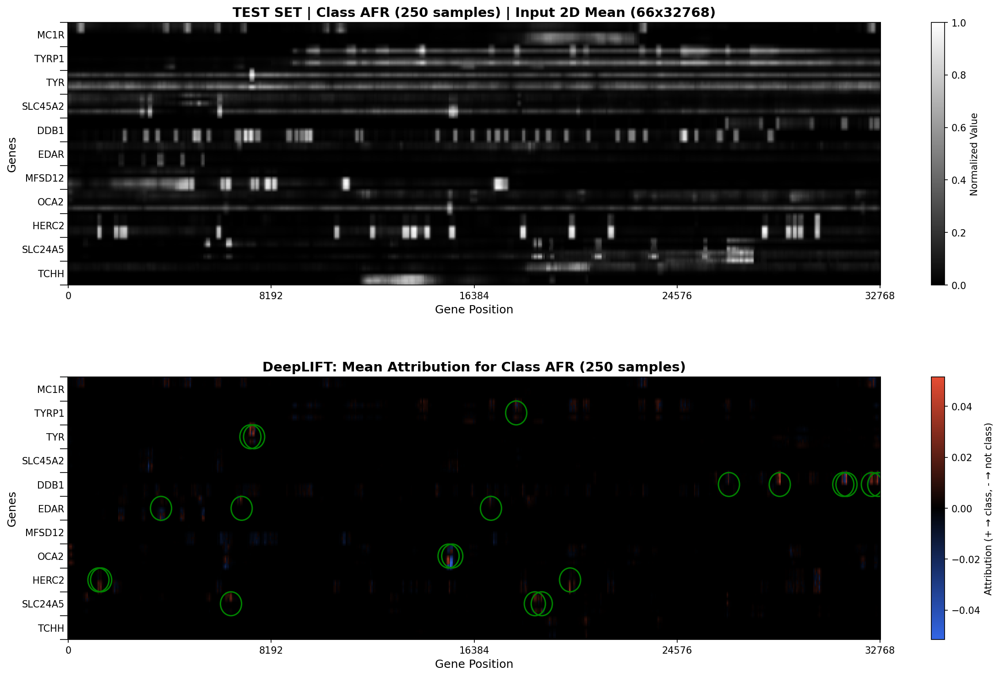

# DeepLIFT Interpretability

> **Understanding What Your Model Has Learned**

This document describes the DeepLIFT (Deep Learning Important Features) implementation in the Neural Ancestry Predictor, which provides interpretable attribution maps to understand which genomic regions contribute most to ancestry predictions.

## Table of Contents

- [Overview](#overview)
- [Theoretical Background](#theoretical-background)
- [Configuration](#configuration)
- [Operation Modes](#operation-modes)
- [Top Regions Analysis](#top-regions-analysis)
- [DNA Sequence Extraction](#dna-sequence-extraction)
- [Visualization](#visualization)
- [Output Files](#output-files)
- [Idempotency](#idempotency)
- [Example Workflow](#example-workflow)
- [Interpreting Results](#interpreting-results)

---

## Overview

DeepLIFT is a feature attribution method that explains neural network predictions by comparing neuron activations to a reference (baseline) and propagating contribution scores back to the input layer. This implementation:

- ✅ Computes signed attribution scores for every input element
- ✅ Supports both individual sample and class-mean analysis
- ✅ Identifies top contributing genomic regions per gene
- ✅ Finds individuals with maximum attribution in each region
- ✅ Extracts DNA sequences (H1 and H2 haplotypes) for further analysis
- ✅ Generates publication-ready visualizations

---

## Theoretical Background

### Rescale Rule Approximation

This implementation uses the **Rescale Rule** approximation of DeepLIFT, which is mathematically equivalent to:

```
attribution = gradient × (input - baseline)
```

Where:
- **gradient**: Backpropagated gradients from the target class output
- **input**: The actual input being analyzed
- **baseline**: A reference input (zeros or dataset mean)

This approximation is valid for networks with ReLU activations and provides the same results as the full DeepLIFT algorithm with significantly simpler implementation.

### Reference

Shrikumar et al., 2017 - *"Learning Important Features Through Propagating Activation Differences"*

---

## Configuration

DeepLIFT is configured in the `debug.interpretability` section of your YAML config:

```yaml
debug:
  enable_visualization: true
  visualization:
    width: 600
    height: 660
    downsample_aggregation: "max"  # "max" or "mean" for visualization
  interpretability:
    enabled: true
    method: "deeplift"             # "deeplift" or "gradcam"
    save_images: true
    output_dir: "interpretability_results"
    deeplift:
      baseline: "mean"             # "zeros" or "mean"
      target_class: "AFR"          # Class name or "predicted"
      fasta_length: 2000           # Length of DNA sequence to extract (bp)
      top_regions_mode: "global"   # "per_gene" or "global"
      top_regions_count: 20        # Number of top regions to identify
      min_distance_bp: 50          # Minimum distance (bp) between regions

mode: "test"
test_dataset: "train"              # Which split to analyze
```

### Configuration Parameters

| Parameter | Options | Description |
|-----------|---------|-------------|
| `method` | `"deeplift"`, `"gradcam"` | Interpretability method to use |
| `save_images` | `true`, `false` | Save visualization PNGs and reports |
| `output_dir` | string | Directory for output files |
| `baseline` | `"zeros"`, `"mean"` | Reference input for DeepLIFT |
| `target_class` | class name or `"predicted"` | Which class to compute attributions for |
| `fasta_length` | integer (default: 1000) | Length of DNA sequence to extract (in bp) |
| `top_regions_mode` | `"per_gene"`, `"global"` | Mode for selecting top regions |
| `top_regions_count` | integer (default: 5) | Number of top regions to identify |
| `min_distance_bp` | integer (default: 50) | Minimum distance (bp) between regions (global mode only) |

### Baseline Options

#### `baseline: "zeros"`
- Uses a zero tensor as reference
- Fast computation (no preprocessing needed)
- Good for understanding what makes the input different from "nothing"

#### `baseline: "mean"`
- Uses the mean of up to 10,000 training samples as reference
- Computed once and cached for efficiency
- **Recommended**: Shows what makes the input different from the "average" input
- Prevents data leakage (only uses training set)

---

## Operation Modes

### Individual Mode (`target_class: "predicted"`)

Computes attributions for each sample individually, using the predicted class as the target:

```yaml
deeplift:
  target_class: "predicted"
```

- Generates one visualization per sample
- Shows which regions contributed to that specific prediction
- Useful for debugging individual predictions

### Class Mean Mode (`target_class: "AFR"`, etc.)

Computes the mean attribution across all samples of the specified class:

```yaml
deeplift:
  target_class: "AFR"  # Or "AMR", "EAS", "EUR", "SAS"
```

- Averages attributions over all samples with that target label
- Shows **consistent** patterns that the model uses for that class
- More robust to noise than individual samples
- **Recommended for publication and analysis**

When in class mean mode:
1. The input visualization shows the mean input for that class
2. The DeepLIFT map shows the mean attribution
3. The title indicates the number of samples averaged

---

## Top Regions Analysis

After computing attributions, the system identifies the **Top N Most Active Regions** based on the configured `top_regions_count`.

### Selection Modes

#### Per-Gene Mode (`top_regions_mode: "per_gene"`)

The original mode, compatible with published results:

1. For each gene, find the maximum positive attribution value across all 6 tracks
2. Record the column index (position within the gene window)
3. Rank genes by their peak attribution value
4. Select the top N genes

**Limitation**: Each gene can appear at most once in the results.

#### Global Mode (`top_regions_mode: "global"`)

A more detailed analysis mode:

1. Consider every position (track, column) in the attribution matrix as a candidate
2. Sort all candidates by attribution value (highest first)
3. Filter candidates that are closer than `min_distance_bp` to an already-selected region
4. Select the top N regions

**Advantages**:
- Multiple points from the same gene can be selected
- Identifies distinct peaks within a single gene
- `min_distance_bp` prevents selecting redundant nearby points

### Individual Search

For each top region, the system finds the **individual with the highest attribution** in that specific position:

1. Iterates through all samples of the target class
2. Computes individual DeepLIFT attributions
3. Extracts the value at the specific (gene, column) position
4. Records the sample with maximum value

The output includes:
- Sample ID
- Superpopulation and population
- Attribution value
- Values at all N top regions for comparison

---

## DNA Sequence Extraction

For each individual identified in the top regions analysis, the system extracts DNA sequences centered on the peak attribution position. The sequence length is configurable via the `fasta_length` parameter (default: 1000 bp).

### Extraction Process

1. Locates the FASTA file: `{dataset_dir}/individuals/{sample_id}/windows/{gene}/{sample_id}.H1.window.fixed.fa`
2. Reads the complete sequence
3. Extracts 500 bases before and 500 bases after the center
4. Repeats for H2 haplotype

### Purpose

The extracted sequences can be used for:
- **BLAT/BLAST searches** to identify proteins
- **Variant analysis** to find mutations
- **Motif discovery** to identify regulatory elements
- **Comparison** between individuals with different ancestries

---

## Visualization

### Plot Components

When running in test mode with visualization enabled, you'll see two windows:

#### Main Figure (2 panels)

**Panel 1: Input Data**
- Grayscale heatmap of the (normalized) input
- Y-axis: Genes (11 genes × 6 tracks = 66 rows)
- X-axis: Gene position (0 to window_center_size)

**Panel 2: DeepLIFT Attribution Map**
- Diverging colormap: Blue (negative) ← Black (zero) → Red (positive)
- Positive values indicate features that **support** the target class
- Negative values indicate features that **oppose** the target class
- Green circles mark the top N most active regions (as configured)

### Example Output



*Example: DeepLIFT attribution map for AFR class mean (250 samples, global mode with 20 top regions, 100bp minimum distance)*

#### Track Profile Figure (separate interactive window)

A line graph showing DeepLIFT values along the track with maximum activation for the **top 5 most active genes**:

- **X-axis**: Genomic position (0 to window_center_size)
- **Y-axis**: DeepLIFT attribution value
- **Lines**: One colored line per gene (5 total - the most active ones)
- **Legend**: Shows gene name and track index (e.g., "OCA2 (track 1)")

**Track indices** (AlphaGenome outputs - 3 ontologies × 2 strands):
- `0`: Ontology 1 (strand +)
- `1`: Ontology 2 (strand +)
- `2`: Ontology 3 (strand +)
- `3`: Ontology 1 (strand -)
- `4`: Ontology 2 (strand -)
- `5`: Ontology 3 (strand -)

**Interactive features** (matplotlib toolbar):
- **Zoom**: Rectangular zoom selection
- **Pan**: Drag to move view
- **Home**: Reset to original view (autoescale)
- **Save**: Export as image

### Colormap

The custom colormap uses:
- **Blue (0.2, 0.4, 0.9)**: Maximum negative attribution
- **Black (0.0, 0.0, 0.0)**: Zero attribution
- **Red (0.9, 0.3, 0.2)**: Maximum positive attribution

### Scale

- **Individual mode**: Fixed scale [-0.10, 0.10] for comparison across samples
- **Class mean mode**: Dynamic scale based on data range

---

## Output Files

When `save_images: true`, the following files are generated. Filenames include all interpretability parameters for traceability.

### Visualization PNG

**Class mean mode:**
```
{output_dir}/class_mean_{class}_{N}samples_{mode}_top{count}_{fasta_length}bp_dist{min_dist}bp_base_{baseline}_deeplift.png
```

**Example:**
```
class_mean_AFR_250samples_global_top20_2000bp_dist50bp_base_mean_deeplift.png
```

**Individual mode:**
```
{output_dir}/{sample_id}_{predicted_class}_{correct|wrong}_{mode}_top{count}_{fasta_length}bp_dist{min_dist}bp_base_{baseline}_deeplift.png
```

### Top Regions Report

**Filename:**
```
{output_dir}/top_regions_class_mean_{class}_{N}samples_{mode}_top{count}_{fasta_length}bp_dist{min_dist}bp_base_{baseline}_deeplift.txt
```

**Example:**
```
top_regions_class_mean_AFR_250samples_global_top20_2000bp_dist50bp_base_mean_deeplift.txt
```

**Format:**
```
Top 20 Regiões Mais Ativas (DeepLIFT, modo global)
================================================================================
Classe: AFR (250 amostras)
================================================================================

1. DDB1: valor_medio = 0.041460, chr11: 61,082,789
   Indivíduo com maior valor: HG02635 (AFR/YRI, valor = 0.089234)
   Valores nas 20 regiões: DDB1=0.08923, OCA2=0.04512, ...
   DNA H1 (2000bp centradas em chr11:61,082,789):
   >HG02635_H1_DDB1_center_61082789
   ATCGATCGATCGATCGATCGATCGATCGATCGATCGATCGATCGATCGATCGATCGATCG
   ...
   DNA H2 (2000bp centradas em chr11:61,082,789):
   >HG02635_H2_DDB1_center_61082789
   ATCGATCGATCGATCGATCGATCGATCGATCGATCGATCGATCGATCGATCGATCGATCG
   ...

2. OCA2 (track 1): valor_medio = 0.039910, chr15: 28,000,123
   ...
```

**Note**: In global mode, the track index is shown when a gene appears multiple times.

---

## Idempotency

The visualization system is **idempotent**: if output files already exist, they are skipped:

```
[dim]⏭ Skipping visualization (already exists): .../class_mean_AFR_250samples_global_top20_2000bp_dist50bp_base_mean_deeplift.png[/dim]
```

This allows you to:
- Re-run the analysis without recomputing everything
- Add new samples without regenerating existing results
- Resume interrupted runs
- Run with different parameters without overwriting previous results

Since filenames include all parameters, changing any setting (mode, count, distance, baseline, fasta_length) will create new output files.

---

## Example Workflow

### 1. Configure for Class Mean Analysis

```yaml
# configs/genes_interp.yaml
debug:
  enable_visualization: true
  interpretability:
    enabled: true
    method: "deeplift"
    save_images: true
    output_dir: "interpretability_results"
    deeplift:
      baseline: "mean"
      target_class: "AFR"
      fasta_length: 2000
      top_regions_mode: "global"
      top_regions_count: 20
      min_distance_bp: 50

mode: "test"
test_dataset: "train"
```

### 2. Run Analysis

```bash
python3 neural_ancestry_predictor.py --config configs/genes_interp.yaml
```

### 3. Review Console Output

```
Top 20 Regiões Mais Ativas (DeepLIFT, modo=global):
  1. DDB1: valor = 0.041460, chr11: 61,082,789
  2. OCA2 (track 1): valor = 0.039910, chr15: 28,000,123
  3. OCA2 (track 3): valor = 0.038500, chr15: 28,000,250
  4. HERC2: valor = 0.032900, chr15: 28,356,789
  5. TYR: valor = 0.030990, chr11: 89,178,456
  ...

Buscando indivíduos com maior DeepLIFT em cada região...
  → 250 amostras da classe alvo
  Processando região 1/20: DDB1...
    ✓ DDB1: HG02635 (AFR/YRI, valor = 0.089234)
  Processando região 2/20: OCA2 (track 1)...
    ✓ OCA2: NA19143 (AFR/ESN, valor = 0.078562)
  ...
```

### 4. Examine Output Files

- View `interpretability_results/class_mean_AFR_250samples_global_top20_2000bp_dist50bp_base_mean_deeplift.png`
- Analyze `interpretability_results/top_regions_class_mean_AFR_250samples_global_top20_2000bp_dist50bp_base_mean_deeplift.txt`
- Use extracted DNA sequences for BLAT/BLAST analysis

---

## Interpreting Results

### What Do Positive Attributions Mean?

Positive attribution values indicate input features that **increase** the model's confidence in the target class. For ancestry prediction:

- High positive attribution in a gene region suggests that gene contains **ancestry-informative variation**
- The pattern of attribution across tracks (cell types) shows **which biological processes** are most informative

### Known Pigmentation Genes

The model typically highlights genes known to be associated with pigmentation and ancestry:

| Gene | Chromosome | Known Association |
|------|------------|-------------------|
| SLC24A5 | chr15 | Skin pigmentation, European ancestry |
| SLC45A2 | chr5 | Skin/hair pigmentation |
| OCA2 | chr15 | Eye/skin color, oculocutaneous albinism |
| HERC2 | chr15 | Blue/brown eye color |
| MC1R | chr16 | Red hair, fair skin |
| TYR | chr11 | Tyrosinase, melanin synthesis |
| TYRP1 | chr9 | Tyrosinase-related protein |

### Validation

To validate that the model has learned biologically meaningful patterns:

1. Compare top regions with known GWAS hits for pigmentation/ancestry
2. Check if identified variants are in functional regions
3. Verify that different ancestries show distinct patterns
4. Cross-reference with published ancestry-informative markers (AIMs)

---

## Troubleshooting

### All attributions are zero

- Check that the model is trained and loaded correctly
- Verify that `enable_visualization: true` is set
- Ensure `mode: "test"` is configured

### Class not found

If you specify a target class that doesn't exist:
```
[yellow]⚠ Classe 'XYZ' não encontrada, usando predita[/yellow]
```
Use one of: `AFR`, `AMR`, `EAS`, `EUR`, `SAS` (for superpopulation)

### DNA extraction fails

```
[yellow]⚠ Arquivo FASTA não encontrado: .../HG00096.H1.window.fixed.fa[/yellow]
```
Verify that `dataset_dir` points to a complete dataset with individual FASTA files.

### Memory issues

For large datasets, the individual search can be memory-intensive. Consider:
- Reducing the dataset size
- Using a subset of samples
- Running on a machine with more RAM

---

## References

- Shrikumar, A., Greenside, P., & Kundaje, A. (2017). Learning Important Features Through Propagating Activation Differences. *ICML*.
- Ancona, M., Ceolini, E., Öztireli, C., & Gross, M. (2018). Towards better understanding of gradient-based attribution methods for Deep Neural Networks. *ICLR*.

---

**Author**: Neural Ancestry Predictor Team  
**Last Updated**: 2025-12-24  
**Version**: 1.1

