# Predicting Skin Pigmentation Class from AlphaGenome-Derived Regulatory Signal: A Detailed Results Report

**Scope of this document**: this report assembles, in one place, the methodology, thinking process,
and real results produced across `01_overview_and_vep.ipynb` through `07_gwas_baseline.ipynb` in
this directory. Every number below was pulled directly from the executed notebooks (not
reconstructed from memory) — cell IDs are cited so any figure can be traced back to its source
cell. The intent is to give you and your colleagues everything needed to decide (a) whether to
continue investing in this line of work, and (b) whether the current results, as they stand, are
publishable.

**Headline answer, stated up front so it doesn't get lost in the details**: the pipeline is
methodologically careful (held-out evaluation, FDR correction, a real classical-GWAS baseline with
proper QC, an interpretability pass, extensive internal caveats already documented notebook-by-
notebook), but the central results are currently confounded by a design choice that cannot be
fixed by more modeling: **"pigmentation class" in this dataset is a population-membership label
(African-ancestry vs. European-ancestry 1000 Genomes populations), not a measured phenotype.** Every
downstream number — 99% classification accuracy, thousands of "significant" genes/variants — is
consistent with the models picking up general population-structure signal rather than
pigmentation-specific biology, and two independent checks in this report actively point that
direction (GTEx concordance at chance level; a plain classical GWAS baseline finding comparably
strong "significance" using 60-year-old statistics). Section 14 lays out concretely what would need
to change before this is a defensible publication claim.

---

## 1. Motivation and research question

The question driving this project: can AlphaGenome — a sequence-to-function model that predicts
regulatory tracks (RNA-seq, chromatin accessibility, histone marks, etc.) from DNA sequence alone —
be used to (a) distinguish individuals by a pigmentation-associated phenotype from their genotype
via predicted gene expression, and (b) score which specific non-coding variants in known
pigmentation genes are functionally consequential, in a way that agrees with independent evidence
(published literature, GTEx eQTLs) and adds something over classical genetic-association methods?

This was pursued as an exploratory, notebook-driven analysis (not a pre-registered study), evolving
through several methodological iterations that are documented as they happened, including at least
one approach (automated gene-ranking) that was tried and explicitly rejected once it produced
biologically incoherent results (Section 3).

### 1.1 A framing question worth answering before the results: does predicting expression, rather than working with raw genotype, protect this pipeline from population-stratification confounding?

It's tempting to assume that routing genotype through AlphaGenome into a *predicted expression*
signal — conceptually similar to a TWAS (transcriptome-wide association study), which is often
pitched as an improvement over plain GWAS — buys some protection from the ancestry-confound problem
described in Section 2. It does not, and it's worth being precise about why, since the same logic
determines how much weight the rest of this report's results can bear.

**What TWAS actually improves on over GWAS has nothing to do with stratification.** Classical TWAS
(PrediXcan/FUSION-style) trains a *sparse* predictor of expression from a small set of validated
cis-eQTL SNPs in a reference panel, then tests that predicted expression against the phenotype in a
separate cohort. Its benefits are statistical and interpretive: fewer tests (one per gene instead of
one per SNP), a specific mechanistic hypothesis instead of an anonymous LD block, and sometimes more
power when the causal mechanism really is cis-regulatory. **None of that addresses ancestry
confounding.** Standard TWAS practice still requires ancestry PCs / ancestry-matched reference
panels for exactly the same reason GWAS does — the statistical-genetics literature on "TWAS
confounding" treats LD/ancestry contamination between eQTL weights and the phenotype as an open
problem TWAS *inherits*, not one it fixes.

**Mechanistically, why AlphaGenome doesn't change this**: predicted expression, however it's
computed, is still a deterministic function of local genotype. If genotype in a window is
population-differentiated — which pigmentation-gene windows are, almost by definition, since that
differentiation is *why* they were discoverable as pigmentation genes in the first place — then any
function of that genotype (linear TWAS weights, or AlphaGenome's nonlinear sequence-to-function
model) inherits the same differentiation, unless the function specifically discards the
population-correlated component of the input and keeps only the trait-causal component. AlphaGenome
has no mechanism for doing that: it has no notion of "this variant is the real pigmentation-causal
one" versus "this variant just happens to differ in frequency between African and European
populations because of demographic history" — it returns a predicted track for whatever sequence
it's given.

If anything, **this pipeline is more exposed to that leakage than classical TWAS, not less**: real
TWAS restricts to a small, cross-validated set of cis-eQTL SNPs, while the two scalar classifiers
here (Section 6) run AlphaGenome on an individual's *entire* real diploid consensus sequence for the
window — every variant present, causal or not, shapes the output — and the neural model (also
Section 6) goes further still, using the raw per-position signal across ~1M positions rather than a
single gene-level expression scalar, an enormous, largely uninterpreted representation with far more
surface area for ancestry-correlated (not necessarily biologically causal) structure to leak into
than a handful of validated eQTL weights.

Where a sequence-to-function model like AlphaGenome plausibly *would* offer something GWAS/TWAS
structurally cannot — fine-mapping within an LD block, i.e. distinguishing among near-perfectly
linked SNPs by recognizing that only one of them sits in a real regulatory motif — is a claim about
scoring *individual variants*, not about classifying individuals, and it is exactly what Section 9's
GTEx concordance check tests. That check comes back at chance level (52.4%), so before AlphaGenome
can be trusted to adjudicate between candidate causal SNPs within a block, it would first need to
reliably get the *sign* right for eQTLs with independently known measured direction — which it does
not yet do reliably on this gene panel. Sections 6–11 should be read with this in mind: nothing
about routing genotype through AlphaGenome's expression predictions structurally protects this
project's results from the same population-stratification confound that would affect a plain GWAS
on the same cohort/phenotype.

### 1.2 How AlphaGenome works and how it's used here: a visual walkthrough (notebooks 1–3)

Before the results, it's worth showing concretely what AlphaGenome outputs and the three
progressively more involved ways this project uses it — reference-sequence prediction, single-
variant effect scoring, and per-individual diploid consensus prediction aggregated across a
population. Every image below is a real, unmodified output from the notebooks.

**1. What AlphaGenome predicts, given a reference genome window.** For any genomic interval,
AlphaGenome returns a continuous, per-base-pair predicted signal track for a requested output type
(here, RNA-seq) and biosample/ontology term. Below: MC1R's window, unmodified GRCh38 reference,
predicted melanocyte-of-skin RNA-seq on both strands, with the gene/transcript structure from
GENCODE drawn above the track for reference — this is the basic unit everything else in this
project is built from (`01_overview_and_vep.ipynb`).

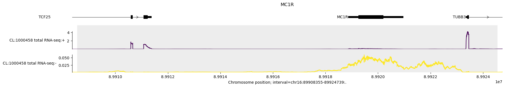

**2. Scoring a single variant's predicted effect.** AlphaGenome can predict the same track for a
mutated sequence (one allele substituted at one position) and compare it against the reference
prediction — the difference is the model's predicted regulatory consequence of that specific
variant. Below: one of MFSD12's literature (GTEx eQTL) variants, `chr19:3565255:G>A`, REF vs. ALT
predicted tracks overlaid (they are visually close here — consistent with the generally small
per-variant effect sizes reported throughout this project, e.g. Section 5's fold-change table).

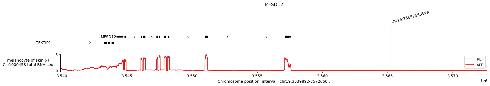

Individual variant scores are aggregated and compared against a random background set of real
1000-Genomes variants from the same window, to check whether curated/literature variants stand out
from ordinary genetic variation (this specific comparison method, and its role in Sections 8–9, is
described in `01_overview_and_vep.ipynb`):

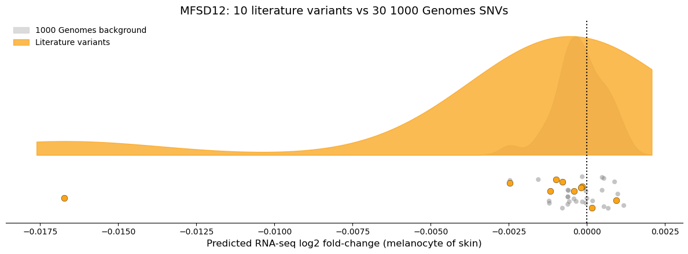

**3. Per-individual, diploid, personalized prediction.** Real individuals are diploid and carry
many variants at once, not one substitution in isolation. For each person, both haplotypes (H1/H2)
have their own consensus sequence built (via `bcftools consensus` against that person's phased
1000 Genomes genotype) and are each run through AlphaGenome separately, then summed. Below: two
specific individuals — one from GWD (African, "strong pigmentation" class) and one from GBR
(European, "weak pigmentation" class) — compared at DDB1 (`02_individual_predictions.ipynb`). Note
how close the two individuals' predicted tracks are to each other here — a single pairwise
comparison like this rarely shows a clean class difference, which is exactly why the analysis needs
to move to the population level next.

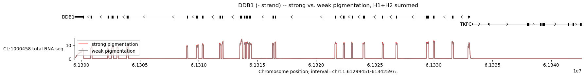

**4. From one pair of individuals to a population-level comparison.** `03_population_analysis.ipynb`
runs this same per-individual diploid prediction for all 862 train-split individuals and averages
the result within each class, for every one of the 11 genes at once. This is the figure that
directly motivates Section 5's per-gene statistical test below — look closely at how similar the
red ("strong pigmentation") and gray ("weak pigmentation") curves are for every gene, despite most
of these differences later reaching extremely small p-values purely because of the large sample
size (n=862):

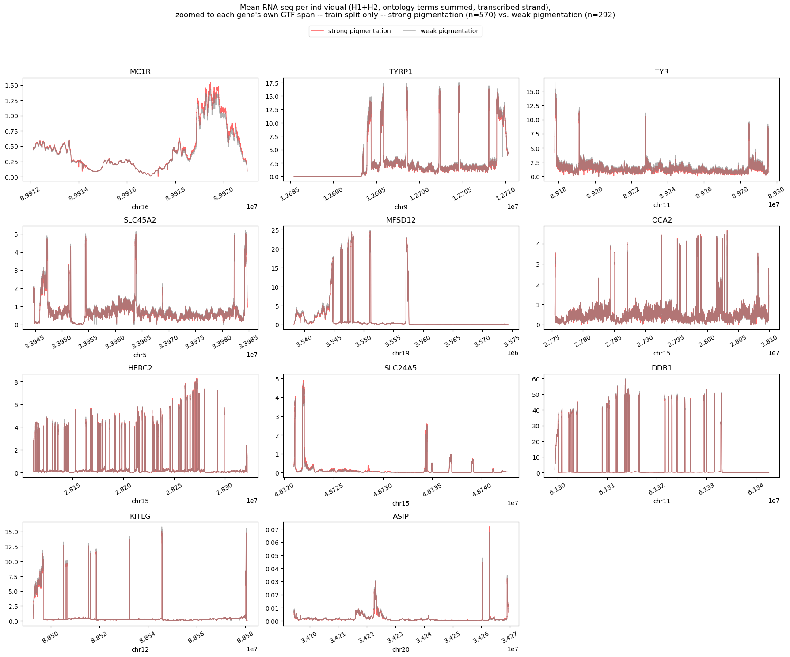

## 2. Data: cohort, phenotype definition, and its central limitation

**Source**: 1000 Genomes Project, high-coverage (30x) phased SNV/INDEL/SV panel, GRCh38. 1,072
individuals across 8 populations were used, split into two classes by population membership
(`notebooks/data/experiment.json`, `class_map`):

| Class | Populations | N |
|---|---|---|
| "strong pigmentation" | YRI, ESN, LWK, MSL, GWD (African) | 703 |
| "weak pigmentation" | FIN, CEU, GBR (European) | 369 |

**This is the single most consequential methodological decision in the whole project, and it is
worth stating plainly**: there is no measured pigmentation phenotype anywhere in this pipeline
(no melanin index, no reflectometry, no self-report). "Strong"/"weak pigmentation" is a coarse proxy
built entirely from which 1000 Genomes population panel an individual belongs to. This is a
reasonable, common simplification in population-genetics teaching examples (these population groups
do differ substantially in average skin pigmentation, and the panel of genes chosen — Section 3 —
is genuinely pigmentation-associated in the literature), but it means:

- The "label" being predicted is inseparable from *all* African-vs-European population structure —
  not just pigmentation-relevant structure. Any regulatory or genotypic difference between these
  populations (drift, other selected loci, sequencing/reference-bias artifacts) is a candidate
  confound for every result below.
- A model can achieve very high accuracy at this task by detecting "does this genotype look
  African or European" without learning anything specific to pigmentation biology, because these
  specific gene regions are themselves among the most population-differentiated loci in the genome
  (that is *why* they were discoverable as pigmentation genes in the first place — but it also means
  they are unusually easy to classify by ancestry alone, independent of any AlphaGenome insight).

Every subsequent result needs to be read through this lens. Section 14 returns to this as the
primary blocker to publication in current form.

**Family structure and the train/test split**: 1000 Genomes includes trios and multi-member
families — 214 of the 588 families in this dataset have more than one member (698 of 1,072
individuals). A naive random split would put relatives on both sides of train/test and leak
genotype (and thus predicted expression) across the boundary. `family_aware_train_test_split`
(`notebooks/utils/family_split.py`) groups by `family_id` *within each population* (so the
population mix is preserved on both sides, not left to chance) and splits whole family groups,
80/20:

| Class | Total | Train | Test |
|---|---|---|---|
| strong pigmentation | 703 | 570 | 133 |
| weak pigmentation | 369 | 292 | 77 |
| **Total** | **1,072** | **862** | **210** |

This split is reused identically by every notebook (fixed seed), so "held-out" numbers throughout
this report are on the same genuinely-unseen 210 individuals.

## 3. Gene panel: how the 11 candidate genes were chosen

Two approaches were tried, in this order.

**Attempt 1 (rejected)**: an automated pipeline that (a) queried the Open Targets Platform for any
gene with *any* annotated relationship to "skin pigmentation," then (b) ranked those candidates by
raw GTEx skin-eQTL count, taking the top 10. This produced a biologically incoherent list — genes
like *LRRK2* (Parkinson's disease) and *EPM2A* (Lafora disease) ranked above *OCA2*, *TYR*, and
*SLC45A2*. The root cause: GTEx's per-gene "significant eQTL" count is not LD-pruned to independent
causal signals, so genes sitting in large linkage-disequilibrium blocks accumulate large eQTL counts
purely from correlated neighboring SNPs, unrelated to true biological relevance. This was diagnosed
directly (not assumed) by inspecting the actual candidate ranking, and the whole approach —
including its dedicated exploratory notebook and helper module — was deleted once the result was
recognized as unsound.

**Attempt 2 (used)**: manual curation from the published skin-pigmentation genetics literature,
preferring genome-wide-significant, replicated loci with independent functional support:

| Gene | Evidence |
|---|---|
| MC1R | Valverde et al. 1995 — loss-of-function → red hair/fair skin/UV sensitivity; the most functionally characterized pigmentation gene |
| TYR | Rate-limiting melanogenesis enzyme; repeatedly replicated GWAS hits (Sturm 2009 review) |
| TYRP1 | Melanogenesis enzyme; Sulem et al. 2008 (Icelandic GWAS), Kenny et al. 2012 (Solomon Islands blond hair) |
| OCA2 | Duffy et al. 2007 — oculocutaneous albinism II gene; one of the two largest-effect eye/skin loci |
| HERC2 | Sturm et al. 2008, Eiberg et al. 2008 — intronic regulatory element controlling *OCA2* expression |
| SLC45A2 | Graf et al. 2005 — major light-skin allele in Europeans |
| SLC24A5 | Lamason et al. 2005 — single largest-effect locus for light skin pigmentation, near-fixed in Europeans |
| MFSD12 | Adhikari et al. 2019 (*Nat Commun*); Crawford et al. 2017 (*Science*) — melanosome pH regulator, major finding from African/Latin-American pigmentation GWAS |
| DDB1 | Crawford et al. 2017 (*Science*) — major African-ancestry skin-pigmentation locus |
| KITLG | Miller et al. 2007 (*Cell*) — melanocyte development/migration, replicated in European and East Asian GWAS |
| ASIP | Kanetsky et al. 2002 — MC1R antagonist, one of the most consistently replicated pigmentation GWAS hits |

**Explicitly excluded despite pigmentation-adjacent literature**: EDAR and TCHH (primarily
hair/tooth morphology, not skin), MITF/IRF4/BNC2/TPCN2 (more hair/eye-specific than skin-specific;
AlphaGenome predictions were generated for these during earlier exploration but they were not
carried into the final panel).

**Known correlation within the panel**: OCA2 and HERC2's 524,288bp AlphaGenome prediction windows
overlap by ~235kb (45% of each window), since the genes are physically adjacent on chr15 and the
well-established HERC2-intron regulatory element controlling OCA2 sits inside that overlap. Both
are retained as separate model features, but their expression signals are expected to be
correlated, not independent — relevant whenever comparing their individual coefficients (Section 7)
or GWAS hits (Section 11).

## 4. AlphaGenome prediction pipeline

For each of the 11 genes and each of the 1,072 individuals, a **diploid consensus sequence** was
built for both haplotypes (H1/H2) via `bcftools consensus` against the individual's phased 1000
Genomes genotype and the gene's 524,288bp reference window, then run through AlphaGenome
(`predict_sequence`) requesting the RNA-seq output. This is ~1,072 × 11 × 2 ≈ 23,600 AlphaGenome API
calls in total; the full set was generated and cached (`notebooks/.cache/predictions/`) before
population-level analysis began — confirmed by notebook 3 reporting complete coverage (n=570/292)
for every one of the 11 genes on the train split.

RNA-seq predictions were requested for 3 melanocyte/hair-follicle-adjacent cell ontology terms
(`CL:1000458` melanocyte of skin, `CL:0000346` hair follicle dermal papilla cell, `CL:2000092` hair
follicular keratinocyte); from notebook 3 onward, modeling was restricted to **melanocyte of skin
only** (`CL:1000458`) as the single most directly relevant biosample, rather than summing all three.

## 5. Population-level differential expression (`03_population_analysis.ipynb`)

For each gene, the train-split individuals' H1+H2 predicted RNA-seq signal (melanocyte of skin,
strand-matched to the gene) was averaged within each class, first over the gene's full GTF span,
then restricted to MANE Select transcript exons only (introns/flanking sequence excluded — a
continuous per-base RNA-seq track summed over a full gene span otherwise mixes in a lot of signal
that isn't "gene expression" in the spliced-mRNA sense).

**Fold changes are small.** Whole-gene-span log2 fold-change (strong/weak) ranges from −0.16 (TYR)
to +0.15 (SLC24A5) — i.e., mostly under a ~15% predicted-signal difference between classes:

| Gene | log2FC (whole gene span) | log2FC (MANE exons only) |
|---|---|---|
| TYR | −0.162 | −0.073 |
| TYRP1 | −0.072 | −0.059 |
| SLC45A2 | −0.057 | −0.037 |
| MFSD12 | −0.049 | −0.016 |
| KITLG | −0.048 | −0.069 |
| ASIP | −0.038 | −0.040 |
| DDB1 | −0.009 | −0.010 |
| OCA2 | +0.004 | +0.001 |
| HERC2 | +0.007 | +0.007 |
| MC1R | +0.079 | +0.120 |
| SLC24A5 | +0.147 | +0.061 |

**Statistical significance, per-individual (not per-class-mean).** A Mann-Whitney U test (rank-
based, appropriate for non-normal/zero-inflated expression-like signal) was run per gene on
per-individual MANE-exon mean signal, train split only (n=862), with Benjamini-Hochberg FDR
correction across the 11 genes tested:

| Gene | n strong / n weak | strong mean | weak mean | p-value | FDR q-value | Significant (q<0.05) |
|---|---|---|---|---|---|---|
| MC1R | 570 / 292 | 0.321 | 0.293 | 1.2e-48 | 1.4e-47 | **Yes** |
| KITLG | 570 / 292 | 1.392 | 1.447 | 4.0e-37 | 2.2e-36 | **Yes** |
| TYR | 570 / 292 | 9.869 | 10.380 | 7.7e-36 | 2.8e-35 | **Yes** |
| TYRP1 | 570 / 292 | 11.471 | 11.951 | 7.3e-27 | 2.0e-26 | **Yes** |
| MFSD12 | 570 / 292 | 6.638 | 6.765 | 3.3e-25 | 7.3e-25 | **Yes** |
| SLC24A5 | 570 / 292 | 1.074 | 1.030 | 2.3e-7 | 4.2e-7 | **Yes** |
| SLC45A2 | 570 / 292 | 3.788 | 3.886 | 1.4e-6 | 2.2e-6 | **Yes** |
| HERC2 | 570 / 292 | 1.670 | 1.664 | 6.0e-5 | 7.4e-5 | **Yes** |
| DDB1 | 570 / 292 | 9.092 | 9.134 | 2.0e-6 | 2.8e-6 | **Yes** |
| ASIP | 570 / 292 | 0.0168 | 0.0167 | 0.195 | 0.214 | No |
| OCA2 | 570 / 292 | 3.273 | 3.266 | 0.382 | 0.382 | No |

9 of 11 genes are "significant" — but read this together with the effect-size table above: with
n≈862 and per-individual variance, Mann-Whitney reaches astronomically small p-values (down to
1e-48) for fold-changes as small as 1-2%. **This is a textbook large-n statistical-vs-practical-
significance situation**: statistical significance here mostly reflects sample size and a
population-level systematic shift, not necessarily a biologically large or individually
discriminating effect. **ASIP and OCA2 were excluded from the classifiers below** as a result of
this test — notably, OCA2, one of the most famous, largest-effect pigmentation genes in the
literature (Section 3), shows *no* detectable difference here. This recurs in Section 9 and Section
11 and is discussed as a specific, telling finding in Section 14.

The box+rain plot below shows exactly what this test operates on — the actual per-individual
MANE-exon mean values behind the table above, one panel per gene. The overlap between the two
classes' distributions is substantial for every gene, which is the visual counterpart of the
"large-n" caveat just made:

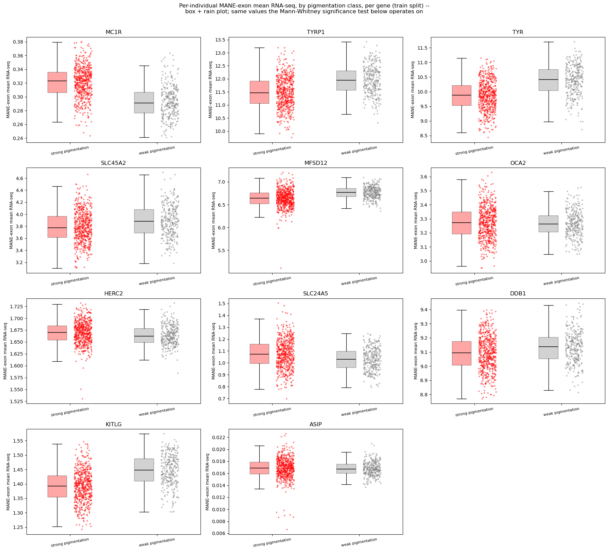

## 6. Model training (`04_modeling.ipynb`)

Three models were trained, all class-weight-balanced (train split is ~2:1 strong:weak) and
evaluated on the same untouched 210-person test split:

1. **`mane_exon_model`**: `StandardScaler` + `LogisticRegression`, one feature per gene =
   `log(MANE-exon mean signal + 0.001)`, using the **9 significant genes** from Section 5. A
   deliberately simple linear baseline (no tuning/cross-validation) — the goal was to check whether
   these 9 genes' signal is separable at all.
2. **`gene_span_model`**: identical setup, but the feature is the whole-gene-span log-mean instead
   of exon-restricted — a check of whether restricting to exons was actually helping.
3. **`nn_model`** (`TinyMLP`): a small 2-layer MLP (32 hidden units, dropout 0.5), fed the full
   **raw per-position** predicted signal for **all 11 genes** (not just the 9 significant ones),
   concatenated into one 1,010,926-dimensional vector per individual. **This is an extreme p ≫ n
   regime: 1,010,926 features against 862 training individuals** — flagged explicitly in the
   notebook as a heavy-overfitting-risk setting to be read as a rough sanity check, not a tuned
   result. Trained 50 epochs with class-balanced `BCEWithLogitsLoss`; **train accuracy reached
   1.000 by epoch 20** and stayed there.

## 7. Held-out evaluation (`05_evaluation.ipynb`)

All three models evaluated on the same 210 held-out individuals (133 strong / 77 weak):

| Model | Accuracy | ROC-AUC | Confusion matrix (rows=true, cols=pred; 0=weak,1=strong) |
|---|---|---|---|
| `mane_exon_model` (9 scalar features) | 0.833 | 0.925 | `[[61,16],[19,114]]` |
| `gene_span_model` (9 scalar features) | 0.895 | 0.965 | `[[64,13],[9,124]]` |
| `nn_model` (1,010,926 raw features) | **0.990** | **0.992** | `[[77,0],[2,131]]` |

The neural model's near-perfect held-out performance, given it reached **perfect training accuracy
in a p≫n regime**, is exactly the pattern expected if the model is exploiting broad,
highly-redundant population-structure signal that is present at a large fraction of the ~1M input
positions (both African and European ancestry leave genome-wide, not just gene-specific, footprints
in a densely-sampled 500kb window) — a confound present identically in train and test since both
were drawn from the same two population panels. It should not be read as evidence that AlphaGenome
has learned fine-grained pigmentation regulatory biology without further, independent validation
(see Sections 9 and 14).

**Gene coefficients** (both LogisticRegression models, sorted by |coefficient|):

| Gene | `mane_exon_model` coef | `gene_span_model` coef |
|---|---|---|
| TYR | −1.067 | −0.925 |
| MFSD12 | −1.038 | **−2.159** |
| MC1R | **+1.001** | **+1.268** |
| KITLG | −0.945 | −0.673 |
| TYRP1 | −0.922 | −0.859 |
| SLC45A2 | −0.502 | −0.523 |
| SLC24A5 | +0.195 | +0.609 |
| DDB1 | −0.190 | −0.181 |
| HERC2 | +0.167 | +0.173 |

**A specific, worth-flagging oddity**: for 5 of 9 genes (TYR, MFSD12, KITLG, TYRP1, SLC45A2) —
including several of the most canonical melanogenesis-enzyme genes — *higher* predicted expression
is associated with the *"weak pigmentation"* class in this data, opposite the naive expectation that
upregulating melanin-synthesis enzymes would associate with more pigmentation. This is not
necessarily wrong (real regulatory biology is often counter-intuitive, and total mRNA level is not
the same as protein activity — SLC24A5's well-known causal variant, for example, changes protein
function, not necessarily transcript abundance), but combined with the near-chance GTEx concordance
result in Section 9, it is at least as consistent with **AlphaGenome's predicted expression
direction not being reliable ground truth for this gene panel** as with a genuine, surprising
biological finding. This is not resolved by the current analysis and is flagged as an open
question in Section 14.

**Reference-genome baseline**: `nn_model` predicts the unmodified GRCh38 reference genome as "weak
pigmentation" with extremely high confidence (P[strong]=0.000, logit ≈ −1,589). Every subsequent
variant-effect analysis (Sections 8–9) measures a *shift* from this baseline.

## 8. Do individual literature variants push predictions the "expected" direction?

For each of the 6 significant genes with at least one GTEx skin-eQTL in its window (KITLG, MC1R,
MFSD12, SLC24A5, TYR, TYRP1 — DDB1, HERC2, and SLC45A2 have **zero** GTEx skin-eQTLs in-window and
were explicitly skipped, not silently dropped), up to 100 literature (GTEx eQTL) variants and 30
random 1000-Genomes background variants were scored with AlphaGenome across **5 methods**: the
model-independent `score_variants` raw score (predicted RNA-seq log2FC), the two LogisticRegression
models' delta-logit relative to the reference genome, the neural model's delta-logit, and (added in
a later iteration, see Section 11) a plink2 GWAS per-allele effect size.

Each literature variant's expected direction ("pro-" vs. "anti-pigmentation") combines **two**
things: the variant's own GTEx-measured direction ("enhance" or "diminish" expression — this varies
per variant, since a gene can have multiple independent eQTLs, some raising and some lowering
expression) and the **gene's own trained coefficient sign** (Section 7 — one fixed value per gene,
which fixes which combination of enhance/diminish counts as "pro" for that gene). A variant is
"pro-pigmentation" if its measured direction agrees with the gene's coefficient-sign convention,
"anti-pigmentation" if it disagrees — so a gene whose eQTLs are all one direction gets a 100%/0%
split (not independent evidence of anything, close to guaranteed by construction), while a gene
with genuinely bidirectional eQTLs splits accordingly (TYR, 32/32, below). Using the gene's own
coefficient sign at all — rather than an independently curated table — is what the notebook flags
as making the check partially circular for `mane_exon_model`'s own logit (a "correct-side" result
there partly just confirms internal consistency) but not for the other 4 scoring methods.

| Gene | Literature variants (GTEx eQTLs) | Pro-pigmentation | Anti-pigmentation |
|---|---|---|---|
| MC1R | 100 | 100 | 0 |
| KITLG | 59 | 0 | 59 |
| TYRP1 | 35 | 32 | 3 |
| TYR | 64 | 32 | 32 |
| MFSD12 | 13 | 11 | 2 |
| SLC24A5 | 2 | 2 | 0 |

MC1R and KITLG happen to have all their GTEx eQTLs pointing one expression direction, so the split
is 100%/0%; TYR's eQTLs are genuinely bidirectional (32 enhance, 32 diminish), giving an exact
50/50 split.

Two real examples of the resulting 5-panel rain plots (all 6 genes' plots are in
`05_evaluation.ipynb`; these two illustrate the range of outcomes). MC1R (100/0 pro-pigmentation,
by construction — see above) shows its literature variants sitting almost entirely on one side of
zero across every panel, background included:

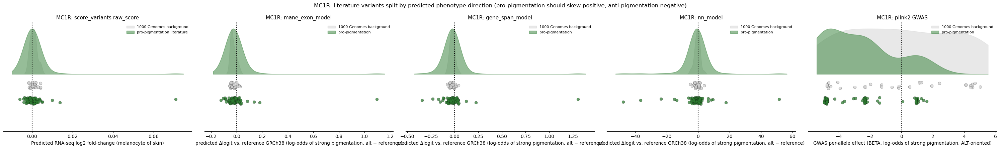

TYR (32 pro / 32 anti) is more representative of the panel as a whole — pro- and anti-pigmentation
groups substantially overlap in most panels, with the clearest separation only showing up in the
GWAS BETA panel on the right:

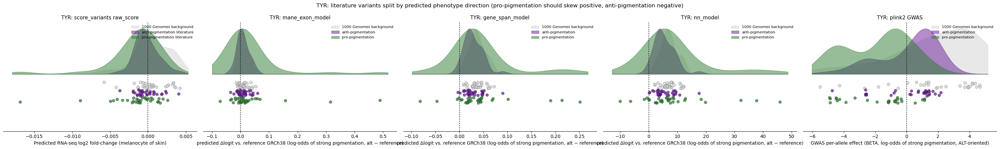

## 9. Does AlphaGenome's predicted direction agree with GTEx's *independently measured* direction?

This is the most important internal validity check in the whole project, and it is a sobering
result. Unlike Section 8 (which derives "expected direction" from this study's own trained
coefficients), this check compares AlphaGenome's **model-independent** `score_variants` raw score
sign against **GTEx's own measured NES sign** — two genuinely independent signed quantities, both
about the same thing (does this allele raise or lower this gene's expression).

Across all 11 genes (up to 100 literature variants/gene, 357 variants total across the 8 genes with
any GTEx eQTLs):

**Overall concordance: 52.4% (187/357) — the notebook's own automated check flags this explicitly:
"WARNING: concordance is near chance (50%)."**

| Gene | n variants | Concordance rate |
|---|---|---|
| MFSD12 | 13 | **76.9%** |
| TYRP1 | 35 | 60.0% |
| TYR | 64 | 53.1% |
| ASIP | 65 | 53.8% |
| MC1R | 100 | 52.0% |
| SLC24A5 | 2 | 50.0% |
| KITLG | 59 | 47.5% |
| **OCA2** | 19 | **31.6%** (below chance) |
| SLC45A2 / HERC2 / DDB1 | — | no GTEx eQTLs in window |

Only MFSD12 (n=13) shows a concordance rate that looks clearly better than chance; OCA2 is
*below* chance. This means that, on this gene panel, AlphaGenome's own predicted direction of
effect on gene expression does not reliably track an independent, real measurement of the same
quantity (GTEx eQTL direction). Notably, **OCA2 is again the outlier** — the same gene that showed
no significant population difference in Section 5 also shows below-chance GTEx concordance here,
a consistent (if negative) signal across two independent parts of the pipeline, discussed further
in Section 14.

Left: per-gene concordance rate (dotted line = chance). Right: every scored variant, GTEx's known
direction (x-axis) against AlphaGenome's predicted direction (y-axis) — green points agree, red
points disagree; the near-even mix of colors on both sides of zero is the visual signature of the
chance-level result:

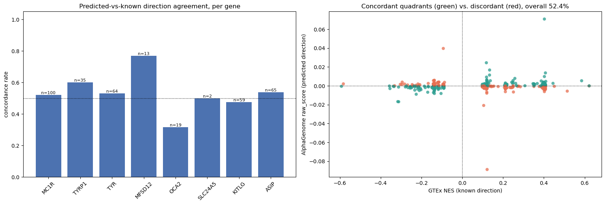

## 10. Interpretability: what does the neural model actually attend to? (`06_interpretability.ipynb`)

DeepLIFT (via `captum`) attributions were computed for `nn_model` on all 210 held-out test
individuals, using a zero/population-mean baseline (meaningful because inputs were
`StandardScaler`-transformed — zero *is* the training-set mean). The completeness property
(`sum(attribution) == output(x) − output(baseline)`) was verified on 5 example individuals and held
to 3+ decimal places, confirming the attributions are computed correctly.

**Important scope caveat, stated in the notebook and worth repeating here**: the model's input is
not DNA sequence — it's AlphaGenome's own *predicted RNA-seq signal* per position. So this measures
"which positions' predicted expression level drive the classification," not which DNA
bases/motifs do. It is one step removed from sequence-level interpretability.

Per-gene exon-importance enrichment (mean |attribution| concentrated in MANE Select exons, relative
to what exons' share of the window would predict by chance — 1.0 = proportional, no exon
enrichment):

| Gene | Exon share of window | Exon share of importance | Enrichment |
|---|---|---|---|
| TYR | 1.7% | 2.8% | **1.60x** |
| KITLG | 6.2% | 7.5% | 1.21x |
| MC1R | 23.8% | 26.6% | 1.11x |
| HERC2 | 7.3% | 7.4% | 1.02x |
| TYRP1 | 11.7% | 11.8% | 1.01x |
| MFSD12 | 5.9% | 5.9% | 1.00x |
| SLC45A2 | 4.3% | 4.0% | 0.92x |
| SLC24A5 | 8.7% | 7.5% | 0.87x |
| DDB1 | 9.8% | 7.6% | 0.77x |

**This is a weak and mixed signal.** Only TYR shows importance clearly concentrated above its exon
share; three genes (SLC45A2, SLC24A5, DDB1) show importance *below* their exon share (i.e., more
important signal sits in introns/flanking sequence than exons for those genes). Most genes sit close
to 1.0x — i.e., importance is roughly proportional to how much of the input window is exonic, which
is close to what you'd expect even from a model with no learned exon-specific structure at all. This
does not strongly support the hypothesis that the model is preferentially using exonic
(splicing/expression-relevant) signal over intronic signal.

Blue = mean |DeepLIFT attribution| per position (held-out test set); green shading = MANE Select
exons. Visually, importance is spread broadly across each window rather than sharply picking out
the green-shaded exons — the same "weak, mixed" pattern the enrichment table quantifies:

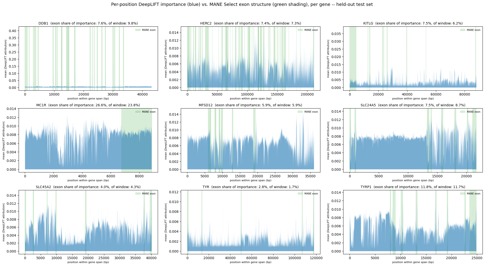

## 11. Classical-statistics baseline: plink2 GWAS (`07_gwas_baseline.ipynb`)

To answer "does AlphaGenome add anything over a standard, well-understood genetic-association
method?", a real plink2 GWAS was built on the same cohort/phenotype/candidate-gene panel, with
genuine QC (not a strawman): MAF/missingness filtering, LD-pruning, relatedness handling, HWE
filtering in controls, and Bonferroni correction scaled to the actual number of tested variants
(not a genome-wide 5×10⁻⁸ threshold, which would be the wrong frame for an 11-gene candidate-region
test).

**Design note, and a real mid-course correction worth mentioning**: the standard approach to
relatedness (`--king-cutoff`, genotype-based kinship) was tried first and produced an implausible
result — it flagged 69% of the cohort as "related" when computed from markers confined to one
524kb candidate gene, because a marker set restricted to the most population-differentiated loci
in the genome conflates "same population" with "genetically related," which genotype-based kinship
methods assume it does not. This was caught by inspection (69% relatedness is not plausible for
this cohort) and fixed by switching to **pedigree-based deduplication** (one individual per 1000
Genomes family, using the database's own published family IDs) — both more correct for this
dataset and simpler.

Deliberately, **no ancestry-PC adjustment was applied** — with a population-membership phenotype,
ancestry PCs would be almost perfectly collinear with the outcome being tested, so "correcting" for
them would remove the signal being measured, not a confound. This mirrors the same limitation
already present on the AlphaGenome side (Section 2) rather than hiding it, which is what makes this
a fair baseline instead of a strawman comparison.

**QC funnel** (from 1,072 individuals / 123,895 variants across the 11-gene merged panel):

| Step | Samples | Variants |
|---|---|---|
| Raw | 1,072 | 123,895 |
| After MAF≥1% / genotype-missingness≤10% / sample-missingness≤10% | 1,072 | 26,966 |
| LD-pruned (informational, for an alternate Bonferroni basis) | — | 2,869 |
| Pedigree-deduplicated (one per family) | 588 | — |
| HWE-in-controls (p>1e-6) | — | 26,931 |
| **Final analysis set** | **588** | **26,931** |

**Association** (logistic regression, sex-covaried only, Firth-fallback for rare variants):

| Gene | Tested variants | Bonferroni-significant (p<1.86e-6) | % significant |
|---|---|---|---|
| MC1R | 3,542 | 987 | 27.9% |
| TYRP1 | 3,269 | 1,071 | 32.8% |
| TYR | 2,986 | 692 | 23.2% |
| SLC45A2 | 2,396 | 636 | 26.5% |
| MFSD12 | 3,241 | 863 | 26.6% |
| OCA2 | 3,071 | 956 | 31.1% |
| HERC2 | 2,516 | 568 | 22.6% |
| SLC24A5 | 1,943 | 584 | 30.1% |
| DDB1 | 1,986 | 515 | 25.9% |
| KITLG | 1,772 | 491 | 27.7% |
| ASIP | 1,398 | 397 | 28.4% |
| **Total** | **26,931** | **7,404 (27.5%)** | |

27.5% of *all* tested variants across the panel clear a stringent Bonferroni threshold — not the
pathological 100% that would signal a pure statistical artifact, but still a very high rate,
consistent with the expected signature of broad AFR/EUR allele-frequency differentiation across
these regions (Section 2), not fine-mapped single-variant causality. LD-based clumping (index p ≤
1e-4, r² > 0.5, within 250kb) collapses this down to **2,040 independent lead signals** across the
panel; the single strongest hit in the entire panel is in HERC2 (chr15:28,465,010, p=1.5×10⁻⁵³),
immediately followed by MC1R (chr16:90,094,439, p=1.6×10⁻⁴⁵) — exactly the loci with the
best-established, largest-effect allele-frequency differences between African and European
populations in the population-genetics literature. OCA2 itself (a distinct gene from HERC2, though
their windows overlap — Section 3) has its own strongest hit at chr15:27,703,972, p=1.5×10⁻⁴¹ —
independently confirmed, not just inherited from its neighbor. This is a real, if unsurprising,
positive control: the GWAS baseline correctly recovers the strongest known signal in the panel
using nothing but 60-year-old logistic regression.

**The pointed comparison for the "what does AlphaGenome add" question**: OCA2 — which showed *no*
significant population difference in the AlphaGenome-based expression test (Section 5) and
*below-chance* GTEx concordance (Section 9) — is the **second-most GWAS-significant gene in the
entire panel by Bonferroni fraction (31.1%)**, with its own strongest single-variant association at
p=1.5×10⁻⁴¹. Genotype-level classical statistics detects OCA2's population-differentiation signal
clearly and strongly; the AlphaGenome-predicted-expression pipeline does not detect it at all. This
is the clearest concrete evidence in this report that the AlphaGenome-expression intermediate step
is not simply a strictly-more-informative superset of what classical genotype-based analysis
already finds — at least for this gene, it appears to lose signal that a much simpler method
retains. (GWAS's coverage of the literature/background variant sets used in Section 8's rain plots
was also checked directly: 85-100% of those variants survived GWAS QC and could be cross-compared,
confirming this isn't an artifact of non-overlapping variant sets.)

Every tested variant, all 11 genes, position within window (x) vs. −log10(p) (y): blue = tested
SNP, orange = a GTEx skin-eQTL, red circle = an independent LD-clumped lead SNP, dashed line =
Bonferroni threshold. Note how much of each panel — OCA2's and HERC2's especially — sits above the
line:

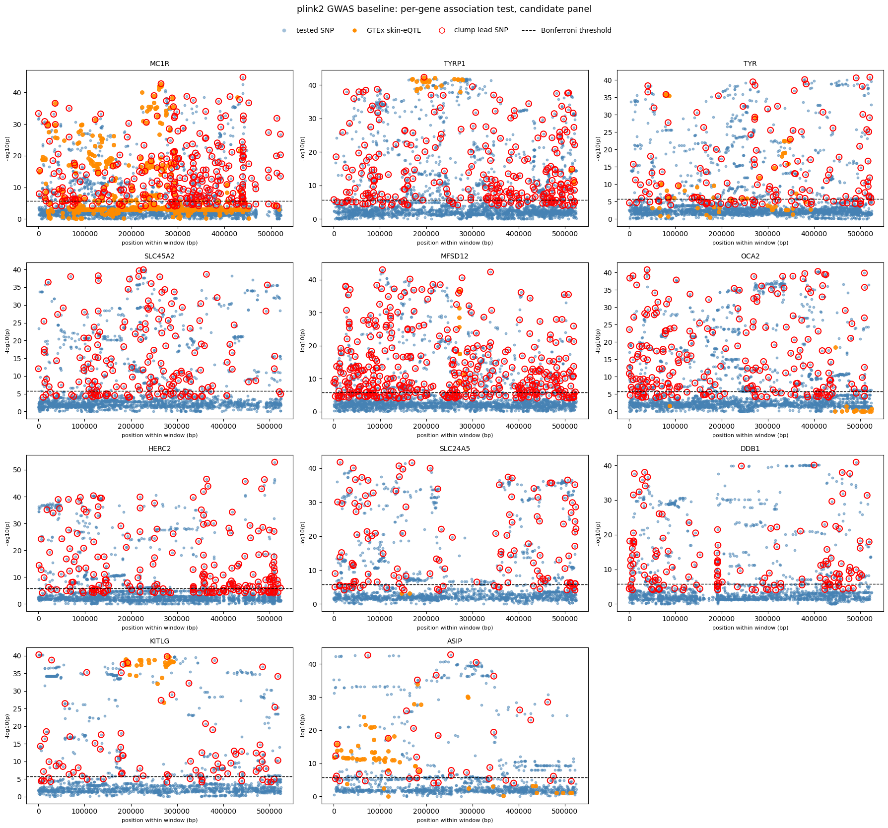

## 12. What was done well (methodological strengths worth preserving)

- **Held-out evaluation on a genuinely unseen, family-disjoint, population-stratified test split**,
  used consistently across all three models and both evaluation approaches.
- **Gene selection was corrected once shown to be unsound**, rather than the flawed automated
  ranking being kept or quietly patched — the failure mode (LD-block-size confound) was diagnosed
  concretely, not hand-waved.
- **FDR correction** (Benjamini-Hochberg) applied to the 11-gene significance test, avoiding
  uncorrected multiple-comparisons inflation.
- **A real, non-strawman classical GWAS baseline** was built specifically to stress-test the
  AlphaGenome results, with genuine QC (MAF/missingness/HWE/relatedness/LD), a Bonferroni threshold
  correctly scaled to a candidate-region (not genome-wide) test, and a documented mid-course
  correction when the first relatedness-handling approach produced an implausible result.
  Multiple-testing correction was reported at two different rigor levels (raw-count and
  LD-pruned-count Bonferroni) rather than picking the more favorable one.
- **An independent concordance check against GTEx** was built and its result (52.4%, near chance)
  was reported as-is, including an automated in-notebook warning, rather than only reporting the
  more favorable per-gene rain-plot direction checks (Section 8) that are partially circular by
  construction.
- **Missing data handled by explicit reporting, not silent omission**, throughout: genes with zero
  GTEx eQTLs, variants that didn't survive GWAS QC, near-100% Bonferroni-significance flagged as a
  named warning condition — this is unusually disciplined bookkeeping for an exploratory analysis.
- **Interpretability (DeepLIFT) was verified for correctness** (completeness property checked
  numerically) before its results were interpreted.

## 13. Threats to validity, collected in one place

1. **Phenotype is a population-membership proxy, not a measured trait** (Section 2) — the
   overarching confound behind everything else in this list.
2. **The neural model operates in an extreme p≫n regime** (1,010,926 features, 862 training
   individuals) and reaches perfect training accuracy — a classic overfitting/shortcut-learning
   signature, made worse (not better) by the population confound, since a shortcut ("does this
   look African or European") is available at enormous redundancy across the input.
3. **GTEx concordance is at chance overall (52.4%) and below chance for OCA2 (31.6%)** — the one
   truly independent validation check built in this project did not confirm AlphaGenome's
   predicted-direction reliability on this gene panel.
4. **Several gene coefficients point the biologically counter-intuitive direction** (Section 7),
   unresolved and plausibly linked to point 3.
5. **A plain classical GWAS baseline recovers comparable-or-stronger "significance"** using the
   same confounded phenotype and simple logistic regression, and in OCA2's case, recovers a strong
   signal that the AlphaGenome-based approach misses entirely (Section 11) — there is currently no
   result in this project demonstrating that AlphaGenome adds information over this baseline.
6. **OCA2/HERC2 feature correlation** (45% window overlap) complicates independent interpretation
   of their individual coefficients/GWAS hits.
7. **No true external replication** — all results are internal to one 1000 Genomes cohort split;
   nothing here has been checked against an independent dataset or a cohort with a real measured
   phenotype.
8. **DeepLIFT exon-enrichment signal is weak and inconsistent across genes** (0.77x–1.60x, mostly
   close to 1.0x) — does not strongly support "the model learned exon-specific regulatory biology"
   over "importance roughly tracks how much of the window is exonic by construction."
9. Minor: one stale sentence survives in `04_modeling.ipynb`'s markdown (a leftover reference to
   "TCHH" as one of the two excluded genes, from an earlier iteration of the panel) — the actual,
   verified-correct excluded genes are ASIP and OCA2 (Section 5). Worth a one-line fix, does not
   affect any number in this report (all numbers here were pulled from executed cell outputs, not
   from that stale prose).

## 14. Is this publishable? What would it take?

**As currently framed — "AlphaGenome predicts individual pigmentation status / uncovers
pigmentation regulatory biology from genotype" — this is not yet publishable.** The central claim
would need to survive the confound in point 1 above, and right now two of the project's own
internal checks (GTEx concordance, the GWAS baseline) are more consistent with "the models are
detecting population structure broadly" than with "the models are detecting pigmentation-specific
regulatory signal." That is a defensible, useful thing to have discovered through careful analysis
— but it is a different (and less exciting) paper than the one the project set out to write.

Two realistic paths forward:

**Path A — fix the phenotype, keep the pipeline.** Replace the population-membership proxy with a
real measured pigmentation phenotype in a cohort with matched genotypes — e.g., a cohort with
quantitative skin reflectance/melanin index, or a large biobank with self-reported skin-tone /
tanning-response phenotypes and genotypes from a single, non-stratified (or admixed, with
proper local-ancestry handling) population, so that "high vs. low pigmentation" is no longer
synonymous with "African vs. European ancestry." This is the highest-leverage single change:
essentially all of the machinery already built (per-individual consensus prediction, the two
scalar classifiers, the neural model, DeepLIFT, the GWAS baseline, the GTEx concordance check) is
directly reusable once the phenotype is real. This is also the only path that would let a strong
result be interpreted as genuine pigmentation biology rather than ancestry classification.

**Path B — reframe as a methods/tooling contribution**, explicit that the current cohort's
classification task is dominated by population structure, and report that honestly as a finding
(e.g., "AlphaGenome-based expression features, like genotype-based methods, are dominated by
population structure when a population-confounded phenotype proxy is used; a rigorous baseline
comparison and independent concordance check are necessary and were often absent from prior
similar work"). This is a legitimate, if more modest, contribution — the GWAS-baseline pipeline,
the GTEx concordance methodology, and the DeepLIFT interpretability pipeline are all reusable,
well-documented pieces of infrastructure regardless of which phenotype is plugged in.

**Before either path, three concrete, comparatively cheap next steps would materially strengthen
whichever direction is chosen**:

1. **Investigate the near-chance GTEx concordance directly** — is it a sign-convention bug
   somewhere in the pipeline (worth ruling out explicitly with a few hand-checked variants against
   raw AlphaGenome/GTEx output), or a real negative result about `score_variants`' reliability on
   this gene panel? This is the single highest-priority open question, since it undercuts every
   variant-level claim in Sections 1 and 8, and would need to be resolved (or the claims scoped
   down) before any variant-direction result is presented externally.
2. **Formalize the AlphaGenome-vs-GWAS comparison quantitatively**, not just visually (Section 11's
   5-panel rain plots exist, but there is no summary statistic yet answering "does AlphaGenome
   correctly identify/rank the GWAS-significant variants better than chance, and does it add
   resolution within GWAS's LD-clumped blocks that GWAS itself cannot provide").
3. **Re-run the modeling pipeline with an ancestry-neutral negative control** (e.g., a matched set
   of non-pigmentation genes, or the same 11 genes but with population labels permuted) to
   establish what "chance-level, structure-only" performance looks like in this exact pipeline —
   this would make points 2, 3, and 5 in Section 13 falsifiable rather than argued qualitatively.

## 15. Where everything lives

| Notebook | Role |
|---|---|
| `01_overview_and_vep.ipynb` | Setup, gene-panel selection & rationale, family-aware split, classical VEP, MFSD12 deep-dive |
| `02_individual_predictions.ipynb` | Per-individual diploid consensus RNA-seq generation (bulk AlphaGenome calls) |
| `03_population_analysis.ipynb` | Population-level mean comparison, MANE-exon restriction, box+rain plots, significance test |
| `04_modeling.ipynb` | Trains and persists the 3 classifiers |
| `05_evaluation.ipynb` | Held-out evaluation, coefficient inspection, literature-variant rain plots (5 scoring methods incl. GWAS), GTEx concordance check |
| `06_interpretability.ipynb` | DeepLIFT attribution vs. MANE-exon structure |
| `07_gwas_baseline.ipynb` | Standalone plink2 GWAS baseline: QC funnel, association, Bonferroni, LD-clumping |

All cached intermediate artifacts (predictions, models, GWAS outputs) live under
`notebooks/.cache/` (gitignored); source data under `notebooks/data/` (gitignored, rebuildable via
`notebooks/utils/prepare_data.py`).
